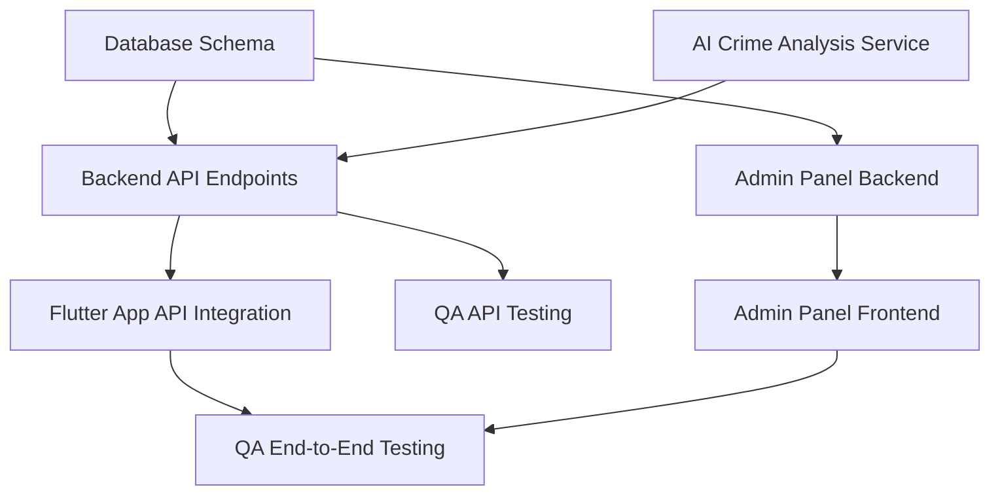

# Agent Task Breakdown: Safe Route App

This document orchestrates the development of the Safe Route App by breaking down the project into specific tasks for different AI development agents. It outlines task dependencies, milestone mapping, parallelization opportunities, and acceptance criteria for each task, ensuring a coordinated and efficient development process.

## 1. Agent Roles and Responsibilities

*   **Backend Agent**: Responsible for developing the FastAPI backend, including API endpoints, database models, business logic, and integration with external services.
*   **Flutter Agent**: Responsible for developing the cross-platform mobile app using Flutter/React Native, including UI/UX, state management, navigation, and hardware integration (GPS, microphone).
*   **AI Agent**: Responsible for developing and integrating the AI Crime Analysis Service, including prompt engineering, AI model selection, and analysis logic.
*   **Database Agent**: Responsible for designing, implementing, and optimizing the PostgreSQL/PostGIS database schema, including tables, indexes, and geospatial queries.
*   **QA Agent**: Responsible for developing and executing the testing strategy, including unit, integration, load, and security tests.
*   **Admin Panel Agent**: Responsible for developing the web-based Admin Dashboard for platform management and moderation.

## 2. Task Dependencies

## 3. Milestone Mapping

The development is planned in phased milestones to ensure incremental progress and early feedback.

*   **Milestone 1: Identity & Auth (Phase 1)**
    *   **Database Agent**: Implement `users`, `sessions`, `emergency_contacts` tables.
    *   **Backend Agent**: Develop `/auth/signup` and `/auth/login` endpoints, including Aadhaar/PAN verification logic.
    *   **Flutter Agent**: Build Splash, Login, Signup, Aadhar Verification, and Emergency Contacts screens.
    *   **QA Agent**: Write unit and integration tests for authentication flow.
*   **Milestone 2: Route Engine & Safety Scoring (Phases 2 & 3)**
    *   **Database Agent**: Implement `routes`, `crime_data`, `unsafe_zones` tables with PostGIS indexing.
    *   **AI Agent**: Develop the AI Crime Analysis Service with Gemini integration.
    *   **Backend Agent**: Develop `/routes/calculate` endpoint and integrate with AI service.
    *   **Flutter Agent**: Build Home screen with destination input and map display of unsafe zones.
    *   **QA Agent**: Test route calculation and safety scoring algorithms.
*   **Milestone 3: Live Monitoring & Emergency System (Phases 4 & 5)**
    *   **Database Agent**: Implement `journey_points` and `emergency_logs` tables.
    *   **Backend Agent**: Develop WebSocket service for live tracking and `/emergency/sos` endpoint.
    *   **Flutter Agent**: Implement background location tracking, SOS button, voice trigger, and deadman switch.
    *   **QA Agent**: Conduct emergency trigger simulations and GPS mock testing.
*   **Milestone 4: Reporting & Admin Dashboard (Phases 6 & 7)**
    *   **Database Agent**: Implement `reports` and `feedback` tables.
    *   **Backend Agent**: Develop SRR generation service and feedback submission endpoint.
    *   **Admin Panel Agent**: Build the Admin Dashboard with core moderation features.
    *   **Flutter Agent**: Implement SRR display and feedback submission screens.
    *   **QA Agent**: Test report generation and admin workflows.
*   **Milestone 5: Optimization & Hardening (Phase 9)**
    *   **All Agents**: Focus on performance optimization, security hardening, and bug fixing based on comprehensive testing results.
    *   **QA Agent**: Execute load tests, chaos testing, and security penetration tests.

## 4. Parallelization Opportunities

*   **Backend & Frontend Development**: Once the API specification is finalized, the Backend Agent and Flutter Agent can work in parallel, with the Flutter Agent using a mock API server until the backend is ready.
*   **AI Service & Backend**: The AI Agent can develop the AI Crime Analysis Service independently, as long as the input/output schema is agreed upon with the Backend Agent.
*   **Admin Panel & Main App**: The Admin Panel Agent can develop the dashboard in parallel with the Flutter Agent developing the main mobile app.
*   **Testing & Development**: The QA Agent can write test cases and set up testing infrastructure in parallel with development activities.

## 5. Acceptance Criteria per Task

### 5.1. Backend Agent Tasks

*   **Task**: Implement `/auth/signup` endpoint.
    *   **Acceptance Criteria**: New users can register with valid data. Aadhaar/PAN verification is successful. Emergency contacts are saved. JWT token is returned. Appropriate error codes are returned for invalid data.
*   **Task**: Develop WebSocket service for live tracking.
    *   **Acceptance Criteria**: WebSocket connection is established for active journeys. Location updates are received and stored. SOS alerts are broadcast to relevant clients.

### 5.2. Flutter Agent Tasks

*   **Task**: Build Home screen with route finder.
    *   **Acceptance Criteria**: User can input destination. Map displays current location and unsafe zones. `FIND PATHS` button triggers route calculation.
*   **Task**: Implement SOS button.
    *   **Acceptance Criteria**: A 5-second press triggers the SOS protocol. Visual feedback is provided during the press. The trigger is reliable and does not have false positives.

### 5.3. AI Agent Tasks

*   **Task**: Develop AI Crime Analysis Service.
    *   **Acceptance Criteria**: Service correctly processes crime data. Gemini API is called with a well-structured prompt. The response is parsed and validated against the output schema. Fallback logic is in place.

### 5.4. Database Agent Tasks

*   **Task**: Implement `journeys` and `journey_points` tables.
    *   **Acceptance Criteria**: Tables are created with correct schema and constraints. Geospatial columns use PostGIS types. Indexes are in place for efficient querying.

### 5.5. QA Agent Tasks

*   **Task**: Write integration tests for authentication.
    *   **Acceptance Criteria**: Tests cover the full signup and login flow, including API calls, database interactions, and token handling.
*   **Task**: Conduct load testing on the `/routes/calculate` endpoint.
    *   **Acceptance Criteria**: System can handle a specified number of concurrent route calculation requests with acceptable response times.

### 5.6. Admin Panel Agent Tasks

*   **Task**: Build the Unsafe Zone Approval workflow.
    *   **Acceptance Criteria**: Admins can view pending flags, approve or reject them, and see the changes reflected in the system.

## 6. Validation Checkpoints

*   **API Spec Review**: Before backend development begins, the API specification is reviewed and approved by both backend and frontend teams.
*   **UI/UX Design Review**: Before frontend development begins, UI mockups and user flow diagrams are reviewed and approved.
*   **Milestone Demos**: At the end of each milestone, a demo is conducted to showcase the completed features and gather feedback.
*   **Code Reviews**: All code is subject to peer review before being merged into the main branch.
*   **Pre-Release Testing**: A full regression and security testing cycle is completed before each release.
