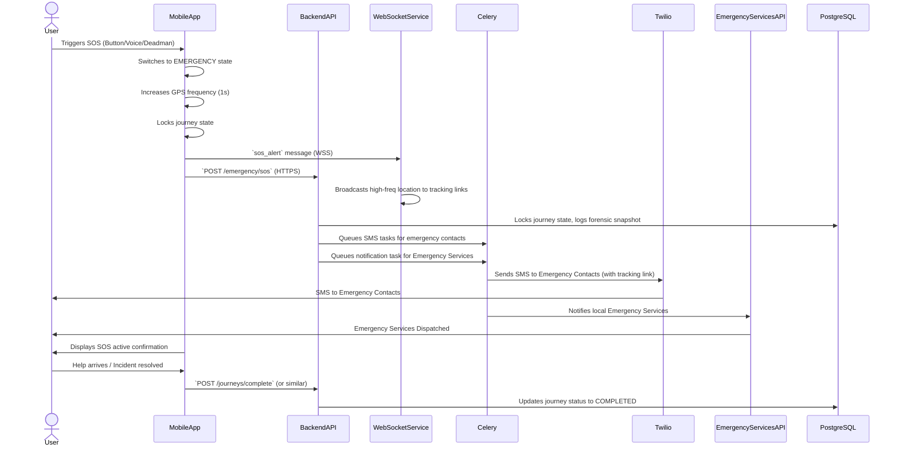

# Emergency Protocols: Safe Route App

This document outlines the comprehensive emergency protocols implemented within the Safe Route App, detailing the SOS lifecycle, contact messaging formats, retry logic, fallback mechanisms, failure handling, and immutable logging structures. These protocols are designed to ensure rapid and reliable response during critical user safety incidents.

## 1. Complete SOS Lifecycle

The SOS lifecycle is a critical sequence of events triggered when a user is in distress. It involves immediate actions on the mobile app, backend processing, and external service integrations.



## 2. Contact Messaging Format

Emergency contacts receive an SMS alert with crucial information to facilitate a rapid response. The message is concise, informative, and includes a direct link for live tracking.

**SMS Message Template**:

```
URGENT! [User's Name] has triggered an SOS alert via Safe Route App. 
Last known location: [Google Maps Link to Lat/Lng]. 
Track their live location here: [Secure Tracking Link]. 
Time: [Timestamp in User's Timezone]. 
Stay Safe!
```

**Example SMS**:

```
URGENT! Jane Doe has triggered an SOS alert via Safe Route App. 
Last known location: https://maps.google.com/?q=12.9716,77.5946. 
Track their live location here: https://saferoute.app/track/xyz123abc. 
Time: 2026-02-07 14:30 IST. 
Stay Safe!
```

## 3. Retry Logic

To ensure message delivery even under adverse network conditions or external service outages, robust retry mechanisms are implemented.

*   **Twilio SMS**: Celery tasks for sending SMS are configured with `max_retries` and exponential backoff. If the initial attempt fails, Celery will automatically retry sending the SMS after a defined delay, increasing the delay with each subsequent attempt.
*   **Emergency Services API**: Notifications to emergency services also utilize retry logic with a limited number of attempts. Critical failures are logged for immediate administrative review.

## 4. Fallback SMS Provider

In the event of a complete outage or severe degradation of the primary SMS provider (Twilio), a fallback mechanism is in place.

*   **Secondary Provider**: A secondary SMS gateway (e.g., SendGrid SMS, local carrier API) is configured as a backup. If Twilio fails after all retries, the system automatically attempts to send messages via the fallback provider.
*   **Direct Device SMS**: As a last resort, if both primary and secondary providers fail, the mobile app attempts to send SMS directly from the user's device via the native SMS functionality, bypassing the backend entirely. This requires explicit user permission and may not include the live tracking link.

## 5. Failure Handling

Comprehensive failure handling ensures that critical information is not lost and appropriate actions are taken even when components fail.

*   **API Failures**: If the `POST /emergency/sos` API call fails, the mobile app will retry the request. If persistent, it will attempt to send a direct SMS to emergency contacts with the last known location.
*   **WebSocket Disconnection**: If the WebSocket connection drops during an emergency, the mobile app will attempt to re-establish it. In parallel, it will continue sending location updates via HTTPS POST requests to a dedicated endpoint.
*   **Database Write Failures**: Critical data, such as forensic snapshots and journey state changes, are written with transactionality. If a write fails, the operation is retried. Persistent failures trigger alerts to administrators.

## 6. Immutable Logging Structure

All emergency events and related data are logged immutably to ensure legal defensibility and forensic analysis capabilities. This data is crucial for understanding the sequence of events during an incident.

**Forensic Snapshot Contains**:
*   **Last 10 Location Points**: Detailed GPS coordinates, timestamps, and accuracy.
*   **Speed**: Speed at each of the last 10 points.
*   **Route Deviation Delta**: Measure of how far the user deviated from the planned route.
*   **Trigger Source**: `button_press`, `voice_activated`, `stationary_timeout`, or `admin_trigger`.
*   **Timestamp**: Exact time of the SOS trigger.
*   **Device State**: Battery level, network status, app version.
*   **User ID**: Identifier of the user in distress.
*   **Journey ID**: Identifier of the active journey.

This data is stored in PostgreSQL with appropriate indexing and is designed to be tamper-proof, potentially using blockchain-like append-only logs or cryptographic hashing for integrity verification.

## 7. Legal Compliance Logging Notes

*   **Data Retention**: Forensic snapshots and emergency logs are retained for a legally mandated period (e.g., 7 years) to support potential legal proceedings or investigations.
*   **Access Control**: Access to emergency logs is highly restricted, requiring multi-factor authentication and explicit authorization for specific personnel.
*   **Audit Trails**: All access and modifications to emergency logs are themselves logged in an unalterable audit trail.
*   **PII Redaction**: While forensic snapshots contain PII, access is controlled, and any display or sharing of this data adheres to strict redaction rules unless legally compelled.

## 8. Public Tracking Link Lifecycle

When a user opts to share their live location or an SOS is triggered, a secure, time-limited public tracking link is generated.

*   **Generation**: A unique, cryptographically secure token (`tracking_link_token`) is generated for each journey or emergency event.
*   **Sharing**: This token is embedded in the SMS sent to emergency contacts, forming a URL (e.g., `https://saferoute.app/track/{token}`).
*   **Access**: Anyone with the link can view the user's live location on a web-based map interface. This interface is read-only and does not expose any other PII.
*   **Expiration**: The tracking link automatically expires:
    *   **Normal Journey**: 2 hours after journey completion.
    *   **Emergency**: Remains active until the emergency is resolved and the journey is marked `COMPLETED` by the user or an administrator, then expires after a grace period (e.g., 1 hour).
*   **Revocation**: Users or administrators can manually revoke a tracking link at any time.
*   **Security**: The token is single-use or time-limited to prevent long-term tracking. IP rate limiting and other security measures protect against brute-force attacks on tracking links.
