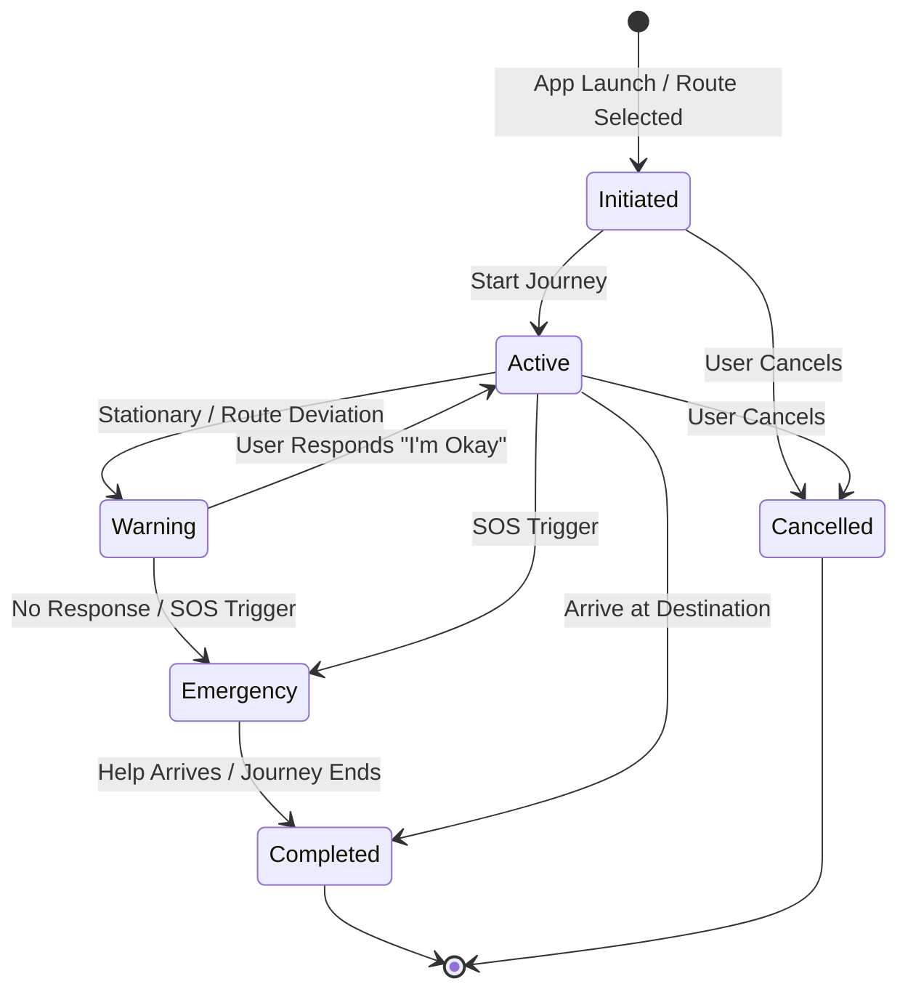
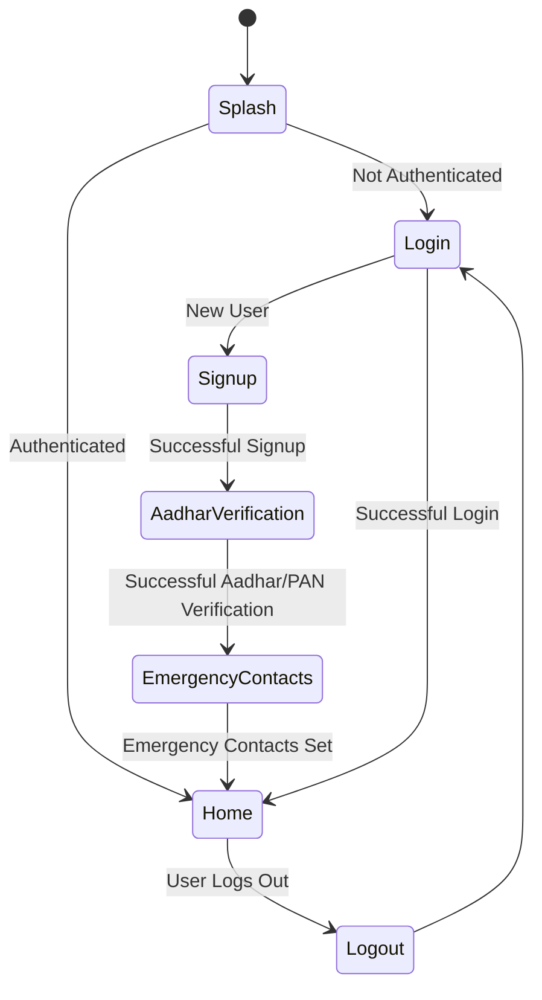

# Frontend Architecture: Safe Route App (Flutter/React Native)

This document details the frontend architecture for the Safe Route App, primarily focusing on its implementation using React Native with Expo. It covers the folder structure, state management model, navigation graph, background services, WebSocket integration, secure storage usage, permission flows, error handling, offline mode logic, and UI state diagrams.

## 1. Core Technologies

*   **Framework**: React Native with Expo (SDK 50+)
*   **Language**: TypeScript
*   **Navigation**: Expo Router (file-based routing) / React Navigation
*   **State Management**: Zustand / React Context
*   **Maps**: `react-native-maps`, Google Maps SDK
*   **Location**: `expo-location`, `expo-task-manager`
*   **Voice**: `@react-native-voice/voice`
*   **HTTP Client**: Axios
*   **WebSocket**: `Socket.io-client`
*   **Storage**: `expo-secure-store` (for tokens)
*   **UI Components**: React Native Paper / NativeBase
*   **Forms**: `react-hook-form`
*   **PDF Generation**: `react-native-html-to-pdf`

## 2. Folder Structure

The frontend project adheres to a modular and scalable folder structure, promoting code organization and maintainability.

```
safe-route-app/
├── App.tsx                   # Root component, main navigation setup
├── app.json                  # Expo configuration
├── babel.config.js
├── tsconfig.json
├── src/
│   ├── assets/               # Static assets (images, fonts, icons)
│   ├── components/           # Reusable UI components (buttons, cards, inputs)
│   │   ├── auth/
│   │   ├── common/
│   │   └── maps/
│   ├── constants/            # Global constants (API_URL, WS_BASE_URL, etc.)
│   ├── hooks/                # Custom React hooks (e.g., useVoiceRecognition)
│   ├── navigation/           # Navigation stacks and navigators
│   │   ├── AuthNavigator.tsx
│   │   ├── MainNavigator.tsx
│   │   └── RootNavigator.tsx
│   ├── screens/              # Top-level screen components
│   │   ├── auth/
│   │   │   ├── LoginScreen.tsx
│   │   │   ├── SignupScreen.tsx
│   │   │   ├── AadharVerificationScreen.tsx
│   │   │   └── EmergencyContactsScreen.tsx
│   │   ├── main/
│   │   │   ├── HomeScreen.tsx
│   │   │   ├── RouteSelectionScreen.tsx
│   │   │   ├── NavigationScreen.tsx
│   │   │   ├── FeedbackScreen.tsx
│   │   │   ├── JourneyHistoryScreen.tsx
│   │   │   └── ProfileScreen.tsx
│   │   └── SplashScreen.tsx
│   ├── services/             # API clients, WebSocket service, location service
│   │   ├── api.service.ts
│   │   ├── auth.service.ts
│   │   ├── location.service.ts
│   │   └── websocket.service.ts
│   ├── store/                # State management stores (Zustand)
│   │   ├── authStore.ts
│   │   └── journeyStore.ts
│   ├── types/                # TypeScript type definitions and interfaces
│   └── utils/                # Utility functions (e.g., date formatting, distance calculation)
└── tests/
```

## 3. State Management Model

The application utilizes a combination of Zustand and React Context for state management, balancing global state accessibility with performance and reusability.

*   **Zustand**: Used for global, application-wide state that needs to be accessed by many components (e.g., authentication status, user profile, current journey details). Zustand provides a lightweight, flexible, and performant alternative to Redux.
    *   `authStore.ts`: Manages user authentication state (JWT token, user ID, login status).
    *   `journeyStore.ts`: Manages the active journey state (journey ID, selected route, status, live location).
*   **React Context**: Employed for localized state management within specific feature domains or for passing props deeply without prop drilling (e.g., map-related configurations, temporary UI states).

## 4. Navigation Graph

The navigation is structured using React Navigation, specifically `createNativeStackNavigator` for authentication flows and `createDrawerNavigator` for the main application flow, as outlined in `safe_route_implementation.md`.

```typescript
// App.tsx - Root Navigation Structure
const RootStack = createNativeStackNavigator();

<NavigationContainer>
  <RootStack.Navigator>
    {/* Auth Flow */}
    <RootStack.Screen name="Splash" component={SplashScreen} />
    <RootStack.Screen name="Auth" component={AuthNavigator} />
    
    {/* Main App Flow */}
    <RootStack.Screen name="Main" component={MainNavigator} />
  </RootStack.Navigator>
</NavigationContainer>

// AuthNavigator (Nested Stack)
const AuthStack = createNativeStackNavigator();
<AuthStack.Navigator screenOptions={{ headerShown: false }}>
  <AuthStack.Screen name="Login" component={LoginScreen} />
  <AuthStack.Screen name="Signup" component={SignupScreen} />
  <AuthStack.Screen name="VerifyAadhar" component={AadharVerificationScreen} />
  <AuthStack.Screen name="EmergencyContacts" component={EmergencyContactsScreen} />
</AuthStack.Navigator>

// MainNavigator (Drawer/Tab Hybrid)
const MainDrawer = createDrawerNavigator();
<MainDrawer.Navigator>
  <MainDrawer.Screen name="Home" component={HomeScreen} />
  <MainDrawer.Screen name="Profile" component={ProfileScreen} />
  <MainDrawer.Screen name="History" component={JourneyHistoryScreen} />
  <MainDrawer.Screen name="Settings" component={SettingsScreen} />
</MainDrawer.Navigator>
```

## 5. Background Services

Background services are crucial for continuous monitoring during a journey, even when the app is not in the foreground. `expo-task-manager` is utilized for this purpose.

*   **Background Location Tracking**: The `LOCATION_TASK_NAME` task, defined using `TaskManager.defineTask`, continuously fetches and sends location updates to the backend via WebSocket. This task is started and stopped using `Location.startLocationUpdatesAsync` and `Location.stopLocationUpdatesAsync`.
    *   **Update Frequency**: 5 seconds (normal mode), 1 second (emergency mode).
    *   **Foreground Service Notification**: A persistent notification informs the user that their journey is being monitored, ensuring transparency and compliance.
*   **Voice Recognition Listener**: The voice trigger system runs a continuous background listener for the trigger phrase, enabling hands-free SOS activation.

## 6. WebSocket Integration

The `WebSocketService` (`services/websocket.service.ts`) handles real-time communication with the backend WebSocket server.

*   **Connection**: Establishes a WebSocket connection to `/ws/journey/{journey_id}` when a journey starts.
*   **Location Updates**: Sends `location_update` messages with `lat`, `lng`, `speed`, and `timestamp` to the server.
*   **SOS Alerts**: Sends `sos_alert` messages with `lat`, `lng`, `trigger_type`, and `timestamp` upon SOS activation.
*   **Reconnection Logic**: Includes built-in reconnection attempts and delays to handle network fluctuations.

## 7. Secure Storage Usage

Sensitive user data, such as authentication tokens, is stored securely on the device using `expo-secure-store`.

*   **Authentication Tokens**: JWT and refresh tokens are stored to maintain user sessions across app launches.
*   **User ID**: The authenticated user's ID is also stored for quick retrieval.
*   **Encryption**: `expo-secure-store` leverages native secure storage mechanisms (e.g., iOS Keychain, Android Keystore) to encrypt data at rest.

## 8. Permission Flow

The app requires several permissions for its core functionalities. These are requested at appropriate times in the user flow.

*   **Location Permissions**: Both foreground and background location permissions are requested during the initial setup or before starting the first journey.
*   **Contacts Permission**: Requested when the user selects emergency contacts from their phone book.
*   **Microphone Permission**: Requested before enabling voice-activated SOS.
*   **Notification Permission**: Requested to display foreground service notifications for background tasks and emergency alerts.

## 9. Error Boundary Handling

Global error boundaries are implemented to gracefully handle unexpected UI errors and prevent app crashes. These boundaries catch errors in their child component tree, log them, and display a fallback UI to the user.

*   **Logging**: Errors caught by error boundaries are logged to a centralized error tracking service (e.g., Sentry) for analysis.
*   **User Feedback**: A user-friendly message is displayed, offering options to restart the app or report the issue.

## 10. Offline Mode Logic

The app is designed to function robustly even with intermittent network connectivity.

*   **Location Data Queueing**: When offline, location updates are temporarily queued on the device. Once connectivity is restored, these queued updates are synchronized with the backend.
*   **Cached Data**: Previously fetched route data and map tiles are cached to provide a seamless experience during offline periods.
*   **Emergency SMS Fallback**: In case of complete network loss, the app attempts to send emergency SMS directly via the device's cellular network, bypassing the backend.

## 11. UI State Diagrams

### 11.1. Journey Lifecycle UI State Diagram



### 11.2. Authentication Flow UI State Diagram


