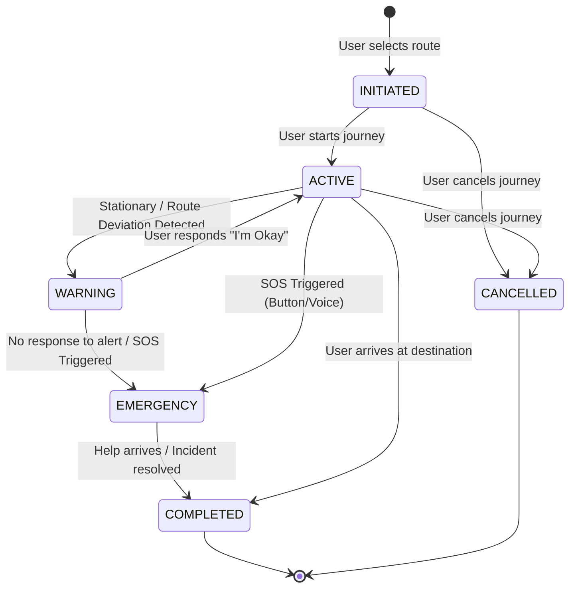

# Live Monitoring Engine: Safe Route App

This document details the architecture and logic of the Live Monitoring Engine, the active guardian layer of the Safe Route App. It covers the journey state machine, deadman switch logic, movement smoothing, voice detection pipeline, emergency escalation flow, GPS anomaly detection, and battery management strategies.

## 1. Journey State Machine

The journey lifecycle is managed through a deterministic state machine, ensuring consistent behavior and accurate logging of user status during travel. Each state transition is logged for forensic and analytical purposes.



**States**:
*   **INITIATED**: Journey has been planned but not yet started.
*   **ACTIVE**: User is actively traveling, and the app is monitoring their progress.
*   **WARNING**: A potential anomaly (e.g., stationary for too long) has been detected, and the user is being prompted for a response.
*   **EMERGENCY**: An SOS event has been triggered, and emergency protocols are active.
*   **COMPLETED**: User has successfully reached their destination.
*   **CANCELLED**: User has manually ended the journey before completion.

## 2. Deadman Logic (Stationary Deadman System)

The Stationary Deadman System is a critical safety feature designed to detect if a user becomes incapacitated or is forced to stop moving.

**Logic**:
*   **Condition**: If the user's location coordinates do not change by more than 10 meters within a 20-minute period.
*   **Trigger**: A vibration alert is sent to the user's phone, accompanied by an on-screen notification asking, "Are you okay?"
*   **Countdown**: A 60-second timer begins. During this countdown, the user can tap "I'm Okay" to dismiss the alert and return to the `ACTIVE` state.
*   **Escalation**: If no response is received within 60 seconds, the app assumes the user is incapacitated or detained and automatically escalates to the `EMERGENCY` state, triggering the full SOS protocol.

**Implementation Details**:
*   **GPS Drift Compensation**: A drift smoothing algorithm is applied to GPS data to prevent false positives caused by minor GPS inaccuracies when the user is genuinely stationary.
*   **Manual Override**: Users can manually override the deadman switch logic if they intend to remain stationary for an extended period (e.g., waiting for someone).
*   **Accessibility Override**: Options for users with disabilities to adjust or disable the deadman switch sensitivity.

**Code Snippet (Frontend - `safe_route_implementation.md`)**:
```typescript
const [lastMovementTime, setLastMovementTime] = useState(Date.now());
const [stationaryAlertActive, setStationaryAlertActive] = useState(false);

const checkStationaryStatus = (location: Location) => {
  const distanceMoved = calculateDistance(
    location.coords,
    previousLocation.coords
  );
  
  if (distanceMoved < 10) { // Less than 10 meters
    const timeSinceMovement = (Date.now() - lastMovementTime) / 1000 / 60;
    
    if (timeSinceMovement >= 20 && !stationaryAlertActive) {
      // Trigger 60-second countdown
      setStationaryAlertActive(true);
      showStationaryAlert();
    }
  } else {
    setLastMovementTime(Date.now());
    setStationaryAlertActive(false);
  }
};

const showStationaryAlert = () => {
  let countdown = 60;
  
  const countdownInterval = setInterval(() => {
    countdown -= 1;
    
    if (countdown === 0) {
      clearInterval(countdownInterval);
      triggerSOS(\'stationary_timeout\');
    }
  }, 1000);
  
  Alert.alert(
    \'Are you okay?\',
    `You haven\'t moved in 20 minutes. Tap "I\'m Okay" or SOS will trigger in ${countdown}s`,
    [
      {
        text: "I\'m Okay",
        onPress: () => {
          clearInterval(countdownInterval);
          setStationaryAlertActive(false);
        },
      },
    ],
    { cancelable: false }
  );
};
```

## 3. Movement Smoothing

To ensure accurate tracking and prevent spurious alerts, GPS data undergoes a drift smoothing algorithm. This algorithm filters out minor fluctuations in reported location that do not represent actual user movement, enhancing the reliability of stationary detection and route deviation alerts.

## 4. Voice Detection Pipeline

The Voice Trigger System provides a hands-free method for activating SOS in an emergency.

**Requirements**:
*   **Offline Keyword Detection**: The system must be able to detect the trigger phrase (e.g., "HELP SAFE APP") even without an active internet connection.
*   **Low Battery Usage**: The background listener for the trigger phrase must be highly optimized to minimize battery consumption.
*   **False Positive Suppression**: Advanced audio processing and machine learning models are employed to reduce false positives from ambient noise or similar-sounding phrases.
*   **Continuous Background Listener**: The app maintains a continuous background listener for the trigger phrase, ensuring immediate response.
*   **Immediate State Switch**: Upon detection of the trigger phrase, the app immediately switches to the `EMERGENCY` state.
*   **Configurable Trigger Phrase**: Users can customize the trigger phrase for personal preference and security.

**Code Snippet (Frontend - `safe_route_implementation.md`)**:
```typescript
import * as Speech from \'expo-speech\';
import Voice from \'@react-native-voice/voice\';

useEffect(() => {
  Voice.onSpeechResults = onSpeechResults;
  Voice.start(\'en-IN\'); // Indian English
  
  return () => {
    Voice.destroy().then(Voice.removeAllListeners);
  };
}, []);

const onSpeechResults = (event) => {
  const spokenWords = event.value[0].toLowerCase();
  
  if (spokenWords.includes(\'help safe app\')) {
    triggerSOS(\'voice_activated\');
  }
};
```

## 5. Emergency Escalation Flow

When an emergency is detected, the system follows a predefined escalation flow to ensure rapid response:

1.  **State Transition**: The journey state immediately transitions to `EMERGENCY`.
2.  **GPS Frequency Increase**: GPS update frequency is increased from 5 seconds to 1 second to provide more granular tracking data.
3.  **Journey State Lock**: The journey state is locked to prevent accidental cancellation or modification.
4.  **Backend Notification**: The mobile app notifies the backend via WebSocket (`sos_alert` message) and a dedicated API endpoint (`POST /emergency/sos`).
5.  **Emergency Contact Notification**: SMS alerts are sent to the user's pre-selected emergency contacts via Twilio, including a live tracking link.
6.  **Forensic Snapshot**: A detailed forensic snapshot of the incident is logged immutably, containing critical data points for post-incident analysis.
7.  **Emergency Services Notification**: An attempt is made to notify local emergency services (e.g., 112/police) via an integrated API.

## 6. GPS Anomaly Detection

Beyond stationary detection, the Live Monitoring Engine incorporates algorithms to detect other GPS anomalies that may indicate distress:

*   **Speed Anomaly Detection**: Detects sudden, uncharacteristic changes in speed (e.g., abrupt stops in a moving vehicle, unusually high speed for a pedestrian).
*   **Route Deviation Detection**: Alerts if the user deviates significantly from the planned route without explicit re-routing. The threshold for deviation is configurable.
*   **Geofencing**: Can be used to define safe zones or restricted areas, triggering alerts if the user enters or exits them unexpectedly.

## 7. Battery Management Strategy

Continuous background monitoring can be battery-intensive. The app employs several strategies to optimize battery usage:

*   **Adaptive GPS Accuracy**: Reduces GPS accuracy when the device battery level falls below a certain threshold (e.g., 20%) to conserve power, while maintaining sufficient accuracy for safety monitoring.
*   **Task Manager Optimization**: Utilizes `expo-task-manager` for efficient background execution, ensuring tasks are run only when necessary and consume minimal resources.
*   **Foreground Service**: The persistent notification for background location tracking ensures the OS prioritizes the app's process, preventing it from being prematurely terminated and optimizing resource allocation.
*   **Offline Data Queueing**: When network connectivity is poor, location updates are queued locally and sent in batches when connectivity improves, reducing continuous radio usage.
