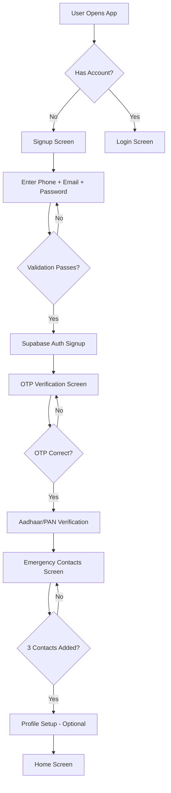

# 02 — User Registration Flow

## Objective
Implement the complete user registration flow including multi-step signup form, input validation, profile creation, and navigation.

---

## Registration Flow Diagram



---

## Signup Screen UI

### Fields & Validation Rules

| Field | Type | Validation | Error Message |
|-------|------|-----------|---------------|
| Phone | `TextFormField` | 10 digits, starts with 6-9 | "Enter a valid Indian phone number" |
| Email | `TextFormField` | Valid email format | "Enter a valid email address" |
| Password | `TextFormField` | Min 8, upper, lower, digit, special | "Password must contain..."|
| Confirm Password | `TextFormField` | Matches password | "Passwords do not match" |

### Password Strength Indicator
```dart
enum PasswordStrength { weak, fair, strong, veryStrong }

PasswordStrength calculateStrength(String password) {
  int score = 0;
  if (password.length >= 8) score++;
  if (password.length >= 12) score++;
  if (RegExp(r'[A-Z]').hasMatch(password)) score++;
  if (RegExp(r'[a-z]').hasMatch(password)) score++;
  if (RegExp(r'[0-9]').hasMatch(password)) score++;
  if (RegExp(r'[!@#\$%^&*(),.?":{}|<>]').hasMatch(password)) score++;
  
  if (score <= 2) return PasswordStrength.weak;
  if (score <= 3) return PasswordStrength.fair;
  if (score <= 4) return PasswordStrength.strong;
  return PasswordStrength.veryStrong;
}
```

### UI Layout
```
┌─────────────────────────────┐
│       ResQ Route Logo       │
│   "Create Your Safe ID"     │
│                             │
│  📱 Phone Number            │
│  [+91 ________________]    │
│                             │
│  📧 Email Address           │
│  [___________________]      │
│                             │
│  🔒 Password                │
│  [___________________]      │
│  [Strength: ████░░  Strong] │
│                             │
│  🔒 Confirm Password        │
│  [___________________]      │
│                             │
│  ☑ I agree to Terms &       │
│    Privacy Policy            │
│                             │
│  [ CREATE ACCOUNT ►]        │
│                             │
│  Already have an account?   │
│       [ Log In ]            │
└─────────────────────────────┘
```

---

## Signup Logic

```dart
// lib/features/auth/domain/usecases/signup_usecase.dart

class SignUpUseCase {
  final AuthRepository _authRepo;
  final UserProfileRepository _profileRepo;

  SignUpUseCase(this._authRepo, this._profileRepo);

  Future<Result<User>> execute({
    required String phone,
    required String email,
    required String password,
  }) async {
    // 1. Validate inputs (client-side)
    final phoneValid = Validators.isValidIndianPhone(phone);
    final emailValid = Validators.isValidEmail(email);
    final passwordValid = Validators.isStrongPassword(password);
    
    if (!phoneValid || !emailValid || !passwordValid) {
      return Result.failure(ValidationError());
    }

    // 2. Create auth user via Supabase
    final authResult = await _authRepo.signUp(
      phone: phone,
      email: email,
      password: password,
    );

    if (authResult.isFailure) return authResult;

    // 3. Create user profile
    await _profileRepo.createProfile(
      userId: authResult.data.id,
      phone: phone,
      email: email,
    );

    return authResult;
  }
}
```

---

## User Profile Model

```dart
// lib/features/auth/data/models/user_profile_model.dart

class UserProfileModel {
  final String id;
  final String phone;
  final String? email;
  final String verificationStatus;
  final String? verificationType;
  final String? profileImageUrl;
  final String? gender;
  final String preferredEmergencyLanguage;
  final double trustScore;
  final bool isActive;
  final DateTime createdAt;
  final DateTime updatedAt;

  UserProfileModel({
    required this.id,
    required this.phone,
    this.email,
    this.verificationStatus = 'pending',
    this.verificationType,
    this.profileImageUrl,
    this.gender,
    this.preferredEmergencyLanguage = 'en',
    this.trustScore = 0.0,
    this.isActive = true,
    required this.createdAt,
    required this.updatedAt,
  });

  factory UserProfileModel.fromJson(Map<String, dynamic> json) {
    return UserProfileModel(
      id: json['id'],
      phone: json['phone'],
      email: json['email'],
      verificationStatus: json['verification_status'] ?? 'pending',
      verificationType: json['verification_type'],
      profileImageUrl: json['profile_image_url'],
      gender: json['gender'],
      preferredEmergencyLanguage: json['preferred_emergency_language'] ?? 'en',
      trustScore: (json['trust_score'] ?? 0.0).toDouble(),
      isActive: json['is_active'] ?? true,
      createdAt: DateTime.parse(json['created_at']),
      updatedAt: DateTime.parse(json['updated_at']),
    );
  }

  Map<String, dynamic> toJson() => {
    'id': id,
    'phone': phone,
    'email': email,
    'verification_status': verificationStatus,
    'verification_type': verificationType,
    'profile_image_url': profileImageUrl,
    'gender': gender,
    'preferred_emergency_language': preferredEmergencyLanguage,
    'trust_score': trustScore,
    'is_active': isActive,
  };
}
```

---

## Error Handling

| Error Case | User Message | Action |
|-----------|-------------|--------|
| Phone already registered | "This phone number is already registered. Try logging in." | Navigate to login |
| Email already registered | "This email is already in use." | Show error inline |
| Weak password | "Password doesn't meet requirements." | Highlight missing criteria |
| Network error | "Connection failed. Please try again." | Retry button |
| Supabase error | "Something went wrong. Please try again later." | Log error, show generic message |

---

## Verification
- [ ] Signup form validates all fields before submission
- [ ] Password strength indicator updates in real-time
- [ ] Successful signup redirects to OTP verification
- [ ] Duplicate phone/email shows appropriate error
- [ ] User profile created in `user_profiles` table
- [ ] Terms & Privacy links are functional
