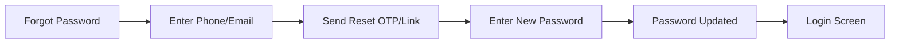

# 03 — Login Flow

## Objective
Implement secure login with phone/email + password, OTP fallback, biometric login option, and robust error handling.

---

## Login Flow Diagram


---

## Login Screen UI

```
┌─────────────────────────────┐
│       ResQ Route Logo       │
│     "Welcome Back"          │
│                             │
│  📱 Phone / Email           │
│  [___________________]      │
│                             │
│  🔒 Password                │
│  [___________________] 👁   │
│                             │
│  [ LOG IN ► ]               │
│                             │
│  Forgot Password?           │
│                             │
│  ─── OR ───                 │
│                             │
│  [ 🔐 Login with Biometrics]│
│                             │
│  Don't have an account?     │
│       [ Sign Up ]           │
└─────────────────────────────┘
```

---

## Login Logic

```dart
class LoginUseCase {
  final AuthRepository _authRepo;
  final SecureStorageService _secureStorage;
  final RateLimiterService _rateLimiter;

  Future<Result<Session>> execute({
    required String identifier, // phone or email
    required String password,
  }) async {
    // 1. Check rate limit
    if (await _rateLimiter.isLocked(identifier)) {
      return Result.failure(
        AccountLockedError('Too many attempts. Try again in 15 minutes.')
      );
    }

    // 2. Determine identifier type
    final isEmail = Validators.isValidEmail(identifier);
    final isPhone = Validators.isValidIndianPhone(identifier);
    
    if (!isEmail && !isPhone) {
      return Result.failure(ValidationError('Enter a valid phone or email'));
    }

    // 3. Attempt login
    try {
      final response = isPhone
          ? await _authRepo.signInWithPhone(phone: identifier, password: password)
          : await _authRepo.signInWithEmail(email: identifier, password: password);

      // 4. Store tokens
      await _secureStorage.saveAccessToken(response.session!.accessToken);
      await _secureStorage.saveRefreshToken(response.session!.refreshToken!);

      // 5. Reset rate limiter
      await _rateLimiter.reset(identifier);

      return Result.success(response.session!);
    } on AuthException catch (e) {
      // 6. Increment failed attempt
      await _rateLimiter.recordFailedAttempt(identifier);
      return Result.failure(AuthError(e.message));
    }
  }
}
```

---

## Forgot Password Flow



```dart
// Send password reset
await Supabase.instance.client.auth.resetPasswordForEmail(email);

// Or for phone
await Supabase.instance.client.auth.signInWithOtp(phone: phone);
```

---

## Biometric Login (Optional Enhancement)

Store an encrypted flag that allows biometric re-authentication:

```dart
import 'package:local_auth/local_auth.dart';

class BiometricAuthService {
  final LocalAuthentication _auth = LocalAuthentication();

  Future<bool> isAvailable() async {
    return await _auth.canCheckBiometrics || await _auth.isDeviceSupported();
  }

  Future<bool> authenticate() async {
    return await _auth.authenticate(
      localizedReason: 'Verify your identity to access ResQ Route',
      options: const AuthenticationOptions(
        stickyAuth: true,
        biometricOnly: false,
      ),
    );
  }
}
```

> [!NOTE]
> Biometric login only works if the user has a valid refresh token stored. If the token has expired, they must re-enter credentials.

---

## Session Check on App Launch

```dart
// In app initialization
Future<void> checkExistingSession() async {
  final session = Supabase.instance.client.auth.currentSession;
  
  if (session != null && !session.isExpired) {
    // Valid session — go to home
    navigateToHome();
  } else if (session != null) {
    // Try to refresh
    try {
      await Supabase.instance.client.auth.refreshSession();
      navigateToHome();
    } catch (e) {
      // Refresh failed — go to login
      navigateToLogin();
    }
  } else {
    // No session — go to login
    navigateToLogin();
  }
}
```

---

## Verification
- [ ] Login with phone + password works
- [ ] Login with email + password works
- [ ] Invalid credentials show error
- [ ] 5 failed attempts locks for 15 min
- [ ] Forgot password sends reset link/OTP
- [ ] Tokens stored in Flutter Secure Storage
- [ ] App auto-logs in if valid session exists
- [ ] Token refresh works silently
