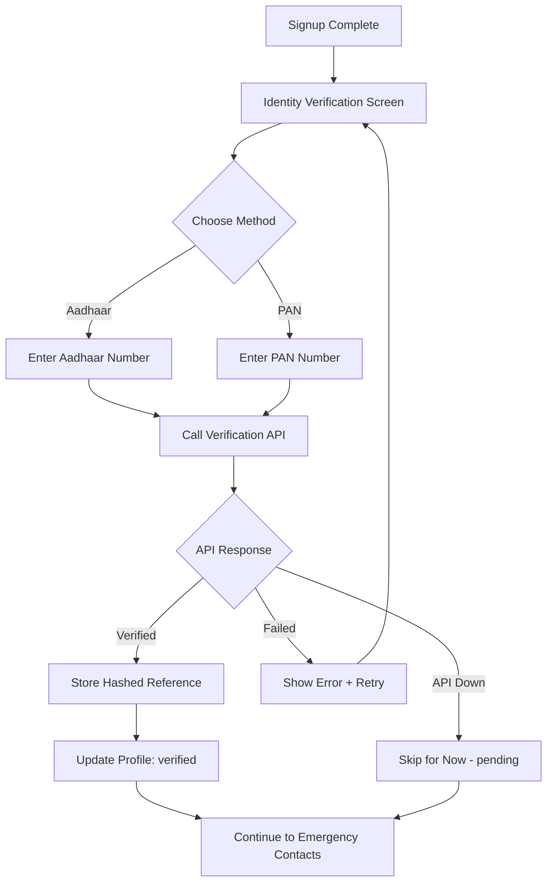

# 04 — Aadhaar/PAN Verification

## Objective
Integrate government identity verification (Aadhaar or PAN) to establish user trust, prevent fake accounts, and comply with identity verification requirements.

---

## Why Identity Verification?

> The app prevents stalking by ensuring no anonymous/fake profiles can track journeys through the live-tracking link. Every user who uses emergency features has a verified real-world identity.

---

## Verification Flow



---

## Security Requirements

> [!CAUTION]
> **NEVER** store raw Aadhaar or PAN numbers in the database. Only store:
> - SHA-256 hash of the number (for uniqueness check)
> - Verification status (`verified`, `pending`, `failed`)
> - Verification type (`aadhar` or `pan`)

---

## Database Columns (Already in `user_profiles`)
```sql
aadhar_hash VARCHAR(255),           -- SHA-256 hash
pan_hash VARCHAR(255),               -- SHA-256 hash
verification_status TEXT DEFAULT 'pending',
verification_type TEXT,
```

---

## Implementation

### Edge Function: `verify-identity`

```typescript
// supabase/functions/verify-identity/index.ts
import { serve } from "https://deno.land/std@0.168.0/http/server.ts"
import { createClient } from 'https://esm.sh/@supabase/supabase-js@2'

serve(async (req) => {
  const { userId, type, number } = await req.json()
  
  // 1. Validate input
  if (type === 'aadhar' && !/^\d{12}$/.test(number)) {
    return new Response(JSON.stringify({ error: 'Invalid Aadhaar format' }), { status: 400 })
  }
  if (type === 'pan' && !/^[A-Z]{5}[0-9]{4}[A-Z]{1}$/.test(number)) {
    return new Response(JSON.stringify({ error: 'Invalid PAN format' }), { status: 400 })
  }

  // 2. Hash the number (NEVER store raw)
  const encoder = new TextEncoder()
  const data = encoder.encode(number)
  const hashBuffer = await crypto.subtle.digest('SHA-256', data)
  const hashArray = Array.from(new Uint8Array(hashBuffer))
  const hash = hashArray.map(b => b.toString(16).padStart(2, '0')).join('')

  // 3. Check for duplicate (prevent same ID on multiple accounts)
  const supabase = createClient(
    Deno.env.get('SUPABASE_URL')!,
    Deno.env.get('SUPABASE_SERVICE_ROLE_KEY')!,
  )
  
  const column = type === 'aadhar' ? 'aadhar_hash' : 'pan_hash'
  const { data: existing } = await supabase
    .from('user_profiles')
    .select('id')
    .eq(column, hash)
    .neq('id', userId)
    .single()

  if (existing) {
    return new Response(
      JSON.stringify({ error: 'This ID is already linked to another account' }),
      { status: 409 }
    )
  }

  // 4. Call external verification API
  // NOTE: Replace with actual API provider
  try {
    const apiKey = Deno.env.get('IDENTITY_VERIFICATION_API_KEY')!
    const apiUrl = Deno.env.get('IDENTITY_VERIFICATION_API_URL')!
    
    const verifyResponse = await fetch(`${apiUrl}/verify`, {
      method: 'POST',
      headers: {
        'Authorization': `Bearer ${apiKey}`,
        'Content-Type': 'application/json',
      },
      body: JSON.stringify({ type, number }),
    })

    const result = await verifyResponse.json()
    const isVerified = result.verified === true

    // 5. Update profile
    await supabase
      .from('user_profiles')
      .update({
        [column]: hash,
        verification_status: isVerified ? 'verified' : 'failed',
        verification_type: type,
      })
      .eq('id', userId)

    return new Response(
      JSON.stringify({ verified: isVerified }),
      { status: 200 }
    )
  } catch (error) {
    // API down — allow user to continue with pending status
    return new Response(
      JSON.stringify({ verified: false, reason: 'service_unavailable' }),
      { status: 503 }
    )
  }
})
```

### Flutter Client Side

```dart
class IdentityVerificationService {
  final SupabaseClient _client;

  Future<VerificationResult> verifyIdentity({
    required String type, // 'aadhar' or 'pan'
    required String number,
  }) async {
    final response = await _client.functions.invoke(
      'verify-identity',
      body: {
        'userId': _client.auth.currentUser!.id,
        'type': type,
        'number': number,
      },
    );

    if (response.status == 200) {
      final data = response.data as Map<String, dynamic>;
      return VerificationResult(
        verified: data['verified'] as bool,
        type: type,
      );
    } else if (response.status == 409) {
      throw DuplicateIdentityException();
    } else {
      throw VerificationServiceException();
    }
  }
}
```

---

## UI Screen

```
┌─────────────────────────────┐
│    🛡️ Verify Your Identity   │
│                             │
│  This helps prevent fake    │
│  accounts and protects all  │
│  users.                     │
│                             │
│  [  Aadhaar  ] [  PAN  ]   │
│                             │
│  Enter Aadhaar Number       │
│  [____ ____ ____]           │
│                             │
│  🔒 Your ID number is       │
│  encrypted and NEVER stored │
│  in its original form.      │
│                             │
│  [ VERIFY ► ]               │
│                             │
│  [ Skip for now → ]         │
│  (Some features will be     │
│   limited until verified)   │
└─────────────────────────────┘
```

---

## Stub Mode (When No API Available)

If the identity verification API is not yet available:
```dart
class StubVerificationService implements IdentityVerificationService {
  Future<VerificationResult> verifyIdentity({...}) async {
    // Simulate verification delay
    await Future.delayed(Duration(seconds: 2));
    // Auto-verify in development
    return VerificationResult(verified: true, type: type);
  }
}
```

---

## Verification
- [ ] Aadhaar format validated (12 digits)
- [ ] PAN format validated (ABCDE1234F pattern)
- [ ] Raw ID never stored — only SHA-256 hash
- [ ] Duplicate ID detected across accounts
- [ ] Verification status updated in `user_profiles`
- [ ] Service unavailability handled gracefully
- [ ] User can skip and continue with limited features
