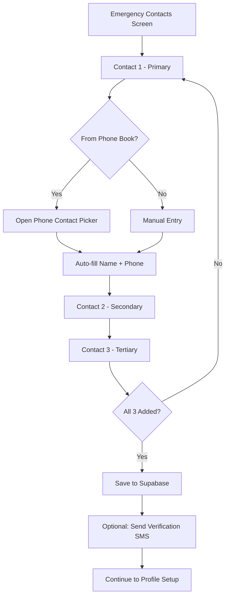

# 05 — Emergency Contacts System

## Objective
Implement the mandatory emergency contacts feature — users must configure exactly 3 trusted contacts who receive alerts during SOS events.

---

## Database Schema

```sql
CREATE TABLE public.emergency_contacts (
    id UUID PRIMARY KEY DEFAULT uuid_generate_v4(),
    user_id UUID NOT NULL REFERENCES auth.users(id) ON DELETE CASCADE,
    name VARCHAR(100) NOT NULL,
    phone VARCHAR(20) NOT NULL,
    priority INTEGER NOT NULL CHECK (priority BETWEEN 1 AND 3),
    relationship VARCHAR(50),         -- e.g., 'parent', 'spouse', 'friend'
    is_verified BOOLEAN DEFAULT FALSE,-- SMS verification to contact
    created_at TIMESTAMPTZ DEFAULT NOW(),
    updated_at TIMESTAMPTZ DEFAULT NOW(),
    
    UNIQUE(user_id, priority),        -- 1 contact per priority level
    UNIQUE(user_id, phone)            -- No duplicate phones per user
);

-- RLS
ALTER TABLE public.emergency_contacts ENABLE ROW LEVEL SECURITY;

CREATE POLICY "Users can CRUD own contacts"
    ON public.emergency_contacts FOR ALL
    USING (auth.uid() = user_id);

-- Index
CREATE INDEX idx_emergency_contacts_user_id ON public.emergency_contacts(user_id);

-- Trigger for updated_at
CREATE TRIGGER update_emergency_contacts_updated_at
    BEFORE UPDATE ON public.emergency_contacts
    FOR EACH ROW
    EXECUTE FUNCTION update_updated_at_column();
```

---

## Contact Selection Flow



---

## UI Screen

```
┌─────────────────────────────┐
│  👥 Emergency Contacts       │
│                             │
│  Choose 3 people who will   │
│  be notified in emergencies │
│                             │
│  ┌───────────────────────┐  │
│  │ 1️⃣ Primary Contact     │  │
│  │ Name: [__________]    │  │
│  │ Phone: [__________]   │  │
│  │ Relation: [Dropdown▼] │  │
│  │ [ 📱 Pick from Contacts]│ │
│  └───────────────────────┘  │
│                             │
│  ┌───────────────────────┐  │
│  │ 2️⃣ Secondary Contact   │  │
│  │ ...                   │  │
│  └───────────────────────┘  │
│                             │
│  ┌───────────────────────┐  │
│  │ 3️⃣ Tertiary Contact    │  │
│  │ ...                   │  │
│  └───────────────────────┘  │
│                             │
│  [ SAVE & CONTINUE ► ]     │
└─────────────────────────────┘
```

---

## Model

```dart
class EmergencyContactModel {
  final String? id;
  final String userId;
  final String name;
  final String phone;
  final int priority; // 1, 2, or 3
  final String? relationship;
  final bool isVerified;

  EmergencyContactModel({
    this.id,
    required this.userId,
    required this.name,
    required this.phone,
    required this.priority,
    this.relationship,
    this.isVerified = false,
  });

  factory EmergencyContactModel.fromJson(Map<String, dynamic> json) {
    return EmergencyContactModel(
      id: json['id'],
      userId: json['user_id'],
      name: json['name'],
      phone: json['phone'],
      priority: json['priority'],
      relationship: json['relationship'],
      isVerified: json['is_verified'] ?? false,
    );
  }

  Map<String, dynamic> toJson() => {
    'user_id': userId,
    'name': name,
    'phone': phone,
    'priority': priority,
    'relationship': relationship,
  };
}
```

---

## Repository Operations

```dart
class EmergencyContactRepository {
  final SupabaseClient _client;

  // Save all 3 contacts (upsert)
  Future<void> saveContacts(List<EmergencyContactModel> contacts) async {
    assert(contacts.length == 3, 'Exactly 3 contacts required');
    
    for (final contact in contacts) {
      await _client
          .from('emergency_contacts')
          .upsert(contact.toJson(), onConflict: 'user_id,priority');
    }
  }

  // Get user's contacts
  Future<List<EmergencyContactModel>> getContacts(String userId) async {
    final response = await _client
        .from('emergency_contacts')
        .select()
        .eq('user_id', userId)
        .order('priority');
    
    return (response as List)
        .map((json) => EmergencyContactModel.fromJson(json))
        .toList();
  }

  // Update single contact
  Future<void> updateContact(EmergencyContactModel contact) async {
    await _client
        .from('emergency_contacts')
        .update(contact.toJson())
        .eq('id', contact.id!);
  }
}
```

---

## Contact Picker Integration

```dart
import 'package:flutter_contacts/flutter_contacts.dart';

class ContactPickerService {
  Future<EmergencyContactModel?> pickContact({
    required String userId,
    required int priority,
  }) async {
    if (await FlutterContacts.requestPermission(readonly: true)) {
      final contact = await FlutterContacts.openExternalPick();
      if (contact != null) {
        final fullContact = await FlutterContacts.getContact(contact.id);
        if (fullContact != null && fullContact.phones.isNotEmpty) {
          return EmergencyContactModel(
            userId: userId,
            name: fullContact.displayName,
            phone: _normalizePhone(fullContact.phones.first.number),
            priority: priority,
          );
        }
      }
    }
    return null;
  }

  String _normalizePhone(String phone) {
    // Remove spaces, dashes, country code prefix
    String normalized = phone.replaceAll(RegExp(r'[\s\-()]'), '');
    if (normalized.startsWith('+91')) normalized = normalized.substring(3);
    if (normalized.startsWith('91') && normalized.length > 10) {
      normalized = normalized.substring(2);
    }
    return normalized;
  }
}
```

---

## Verification SMS (Optional)

Optionally send a one-time SMS to each contact letting them know they've been added:

```
"[User Name] has added you as an emergency contact on ResQ Route. 
If [User Name] triggers an SOS, you will receive their live location. 
No action needed from you."
```

This is sent via Twilio Edge Function and is NOT a mandatory step for contact creation — it's informational.

---

## Edge Case Handling

| Scenario | Handling |
|----------|---------|
| User enters own phone as contact | Reject: "Cannot add yourself" |
| Duplicate phone across contacts | Reject: "Each contact must be unique" |
| Invalid phone format | Inline validation error |
| Contact permission denied | Show manual entry form |
| User has < 3 contacts | Block progression, show helper text |
| User wants to update contacts later | Available from Settings screen |

---

## Verification
- [ ] Contact picker opens device contacts
- [ ] Manual entry works with validation
- [ ] Exactly 3 contacts required to proceed
- [ ] Contacts saved to `emergency_contacts` table
- [ ] RLS prevents cross-user access
- [ ] Duplicate detection works
- [ ] Contacts retrievable after login
- [ ] Update flow works from Settings
