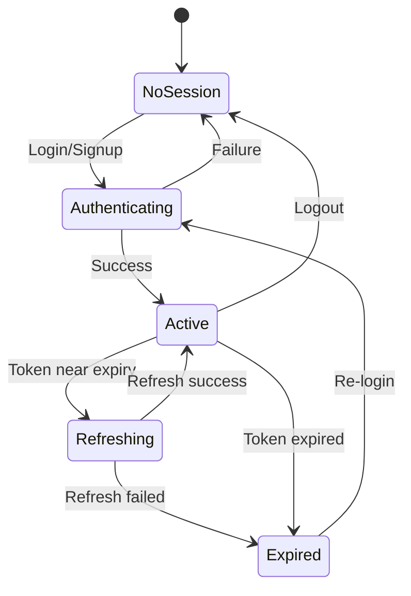

# 06 — Session Management

## Objective
Implement secure session lifecycle management — token storage, auto-refresh, device tracking, and multi-device logout.

---

## Supabase Session Handling

Supabase Auth automatically manages JWT sessions. The key integrations:

### Token Storage

```dart
import 'package:flutter_secure_storage/flutter_secure_storage.dart';

class SecureStorageService {
  final FlutterSecureStorage _storage = const FlutterSecureStorage(
    aOptions: AndroidOptions(encryptedSharedPreferences: true),
    iOptions: IOSOptions(accessibility: KeychainAccessibility.first_unlock),
  );

  // Token keys
  static const _accessTokenKey = 'access_token';
  static const _refreshTokenKey = 'refresh_token';
  static const _biometricEnabledKey = 'biometric_enabled';

  Future<void> saveAccessToken(String token) =>
      _storage.write(key: _accessTokenKey, value: token);

  Future<String?> getAccessToken() =>
      _storage.read(key: _accessTokenKey);

  Future<void> saveRefreshToken(String token) =>
      _storage.write(key: _refreshTokenKey, value: token);

  Future<String?> getRefreshToken() =>
      _storage.read(key: _refreshTokenKey);

  Future<void> clearAll() => _storage.deleteAll();

  Future<void> setBiometricEnabled(bool enabled) =>
      _storage.write(key: _biometricEnabledKey, value: enabled.toString());
}
```

### Auto-Refresh

Supabase Flutter SDK handles token refresh automatically. However, add a wrapper:

```dart
class SessionManager {
  final SupabaseClient _client;
  Timer? _refreshTimer;

  void startAutoRefresh() {
    _refreshTimer?.cancel();
    final session = _client.auth.currentSession;
    if (session == null) return;

    // Refresh 1 minute before expiry
    final expiresAt = DateTime.fromMillisecondsSinceEpoch(
      session.expiresAt! * 1000,
    );
    final refreshIn = expiresAt.difference(DateTime.now()) - Duration(minutes: 1);

    if (refreshIn.isNegative) {
      // Already expired, refresh now
      _client.auth.refreshSession();
    } else {
      _refreshTimer = Timer(refreshIn, () {
        _client.auth.refreshSession();
        startAutoRefresh(); // Schedule next refresh
      });
    }
  }

  void stopAutoRefresh() {
    _refreshTimer?.cancel();
  }
}
```

---

## Device Session Tracking

### Database Table

```sql
CREATE TABLE public.device_sessions (
    id UUID PRIMARY KEY DEFAULT uuid_generate_v4(),
    user_id UUID NOT NULL REFERENCES auth.users(id) ON DELETE CASCADE,
    device_name VARCHAR(100),
    device_os VARCHAR(50),         -- 'android', 'ios'
    device_model VARCHAR(100),
    app_version VARCHAR(20),
    last_active_at TIMESTAMPTZ DEFAULT NOW(),
    created_at TIMESTAMPTZ DEFAULT NOW(),
    is_active BOOLEAN DEFAULT TRUE
);

ALTER TABLE public.device_sessions ENABLE ROW LEVEL SECURITY;

CREATE POLICY "Users manage own device sessions"
    ON public.device_sessions FOR ALL
    USING (auth.uid() = user_id);
```

### Flutter Device Info

```dart
import 'package:device_info_plus/device_info_plus.dart';

class DeviceInfoService {
  Future<Map<String, String>> getDeviceInfo() async {
    final deviceInfo = DeviceInfoPlugin();

    if (Platform.isAndroid) {
      final info = await deviceInfo.androidInfo;
      return {
        'device_name': info.model,
        'device_os': 'android ${info.version.release}',
        'device_model': info.manufacturer,
      };
    } else if (Platform.isIOS) {
      final info = await deviceInfo.iosInfo;
      return {
        'device_name': info.name,
        'device_os': 'ios ${info.systemVersion}',
        'device_model': info.model,
      };
    }
    return {};
  }
}
```

---

## Logout Flow

```dart
class LogoutUseCase {
  final AuthRepository _authRepo;
  final SecureStorageService _secureStorage;
  final SessionManager _sessionManager;

  Future<void> execute({bool allDevices = false}) async {
    // 1. Stop background services
    _sessionManager.stopAutoRefresh();

    // 2. Sign out from Supabase
    if (allDevices) {
      await _authRepo.signOut(scope: SignOutScope.global); // All devices
    } else {
      await _authRepo.signOut(scope: SignOutScope.local);  // This device only
    }

    // 3. Clear local storage
    await _secureStorage.clearAll();

    // 4. Navigate to login
  }
}
```

---

## Session State Diagram



---

## Verification
- [ ] Tokens stored in Flutter Secure Storage (encrypted)
- [ ] Auto-refresh occurs before token expiry
- [ ] Logout clears all local data
- [ ] Multi-device logout works (global signout)
- [ ] Device info recorded per session
- [ ] Expired sessions redirect to login
