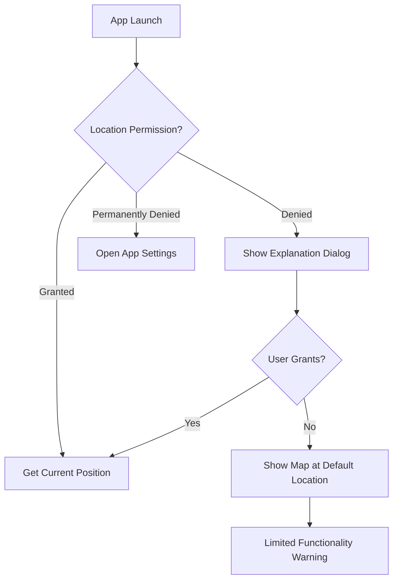

# 02 — Google Maps Integration

## Objective
Integrate Google Maps into the Flutter app with current location tracking, map controls, and custom styling.

---

## Setup

### Required API Services (Google Cloud Console)
Enable these APIs for the project:
- **Maps SDK for Android**
- **Maps SDK for iOS**
- **Directions API**
- **Places API**
- **Static Maps API** (for report snapshots)
- **Geocoding API**

### API Key Restrictions
- Restrict by **Application** (Android: SHA-1 + package name, iOS: bundle ID)
- Restrict by **API** (only the 6 APIs listed above)

---

## Flutter Map Widget

### `lib/features/home/presentation/widgets/safety_map.dart`

```dart
import 'package:google_maps_flutter/google_maps_flutter.dart';
import 'package:geolocator/geolocator.dart';

class SafetyMap extends StatefulWidget {
  final List<UnsafeZone> unsafeZones;
  final LatLng? destination;
  final List<RoutePolyline>? routes;
  final Function(LatLng)? onMapTap;

  const SafetyMap({
    super.key,
    required this.unsafeZones,
    this.destination,
    this.routes,
    this.onMapTap,
  });

  @override
  State<SafetyMap> createState() => _SafetyMapState();
}

class _SafetyMapState extends State<SafetyMap> {
  GoogleMapController? _mapController;
  LatLng _currentPosition = const LatLng(12.9716, 77.5946); // Default: Bangalore
  bool _isLoading = true;

  @override
  void initState() {
    super.initState();
    _getCurrentLocation();
  }

  Future<void> _getCurrentLocation() async {
    final permission = await Geolocator.checkPermission();
    if (permission == LocationPermission.denied) {
      await Geolocator.requestPermission();
    }

    final position = await Geolocator.getCurrentPosition(
      desiredAccuracy: LocationAccuracy.high,
    );

    setState(() {
      _currentPosition = LatLng(position.latitude, position.longitude);
      _isLoading = false;
    });

    _mapController?.animateCamera(
      CameraUpdate.newLatLngZoom(_currentPosition, 15),
    );
  }

  Set<Marker> _buildMarkers() {
    final markers = <Marker>{};

    // Current location marker
    markers.add(Marker(
      markerId: const MarkerId('current_location'),
      position: _currentPosition,
      icon: BitmapDescriptor.defaultMarkerWithHue(BitmapDescriptor.hueAzure),
      infoWindow: const InfoWindow(title: 'You are here'),
    ));

    // Destination marker
    if (widget.destination != null) {
      markers.add(Marker(
        markerId: const MarkerId('destination'),
        position: widget.destination!,
        icon: BitmapDescriptor.defaultMarkerWithHue(BitmapDescriptor.hueGreen),
        infoWindow: const InfoWindow(title: 'Destination'),
      ));
    }

    // Unsafe zone markers
    for (final zone in widget.unsafeZones) {
      markers.add(Marker(
        markerId: MarkerId('unsafe_${zone.id}'),
        position: LatLng(zone.latitude, zone.longitude),
        icon: BitmapDescriptor.defaultMarkerWithHue(BitmapDescriptor.hueRed),
        infoWindow: InfoWindow(
          title: '⚠️ Unsafe Zone',
          snippet: zone.reason,
        ),
      ));
    }

    return markers;
  }

  Set<Polyline> _buildPolylines() {
    if (widget.routes == null) return {};
    return widget.routes!.map((route) {
      final color = _getRouteColor(route.safetyScore);
      return Polyline(
        polylineId: PolylineId(route.id),
        points: route.waypoints.map((w) => LatLng(w.lat, w.lng)).toList(),
        color: color,
        width: route.isSelected ? 6 : 3,
        patterns: route.isSelected ? [] : [PatternItem.dash(20), PatternItem.gap(10)],
      );
    }).toSet();
  }

  Color _getRouteColor(double? score) {
    if (score == null) return Colors.grey;
    if (score >= 80) return Colors.green;
    if (score >= 60) return Colors.orange;
    return Colors.red;
  }

  @override
  Widget build(BuildContext context) {
    if (_isLoading) return const Center(child: CircularProgressIndicator());

    return GoogleMap(
      initialCameraPosition: CameraPosition(
        target: _currentPosition,
        zoom: 15,
      ),
      onMapCreated: (controller) => _mapController = controller,
      markers: _buildMarkers(),
      polylines: _buildPolylines(),
      myLocationEnabled: true,
      myLocationButtonEnabled: true,
      zoomControlsEnabled: true,
      mapToolbarEnabled: false,
      compassEnabled: true,
      onTap: widget.onMapTap,
    );
  }
}
```

---

## Custom Map Styling (Dark Mode)

```dart
// Load custom map style for dark mode
Future<void> _setMapStyle() async {
  if (Theme.of(context).brightness == Brightness.dark) {
    final style = await rootBundle.loadString('assets/map_styles/dark_mode.json');
    _mapController?.setMapStyle(style);
  }
}
```

Generate dark mode JSON from: https://mapstyle.withgoogle.com/

---

## Location Permission Flow



```dart
class LocationPermissionService {
  Future<bool> ensurePermission() async {
    bool serviceEnabled = await Geolocator.isLocationServiceEnabled();
    if (!serviceEnabled) {
      // Prompt user to enable location services
      return false;
    }

    LocationPermission permission = await Geolocator.checkPermission();
    if (permission == LocationPermission.denied) {
      permission = await Geolocator.requestPermission();
      if (permission == LocationPermission.denied) return false;
    }

    if (permission == LocationPermission.deniedForever) {
      // Open app settings
      await Geolocator.openAppSettings();
      return false;
    }

    return true;
  }
}
```

---

## Verification
- [ ] Google Map renders on Home screen
- [ ] Current location detected and centered
- [ ] Unsafe zones shown as red markers
- [ ] Route polylines render with color-coding
- [ ] Dark mode map style applied for dark theme
- [ ] Location permission flow handles all states
- [ ] Map controls (zoom, compass) functional
