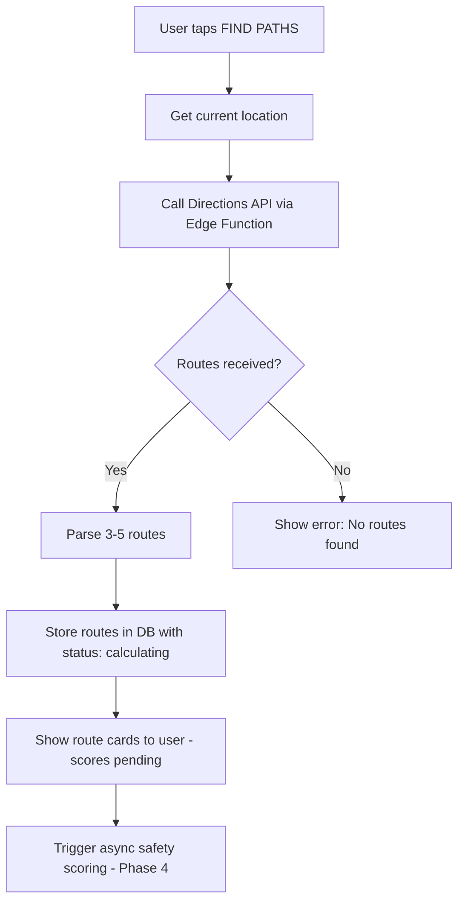

# 03 — Route Fetching Algorithm

## Objective
Fetch 3-5 alternative routes from Google Directions API and prepare them for safety scoring.

---

## Route Fetching Flow



---

## Edge Function: `calculate-routes`

```typescript
// supabase/functions/calculate-routes/index.ts
serve(async (req) => {
  const { originLat, originLng, destLat, destLng, userId } = await req.json();
  
  const apiKey = Deno.env.get('GOOGLE_MAPS_API_KEY')!;
  
  // Fetch routes with alternatives
  const url = `https://maps.googleapis.com/maps/api/directions/json` +
    `?origin=${originLat},${originLng}` +
    `&destination=${destLat},${destLng}` +
    `&alternatives=true` +        // Get multiple routes
    `&mode=walking` +              // Walking mode for safety
    `&key=${apiKey}`;
  
  const response = await fetch(url);
  const data = await response.json();
  
  if (data.status !== 'OK' || !data.routes?.length) {
    return new Response(
      JSON.stringify({ error: 'No routes found' }),
      { status: 404 }
    );
  }

  // Process top 3 routes (or fewer if less available)
  const routes = data.routes.slice(0, 3).map((route: any, index: number) => {
    const leg = route.legs[0];
    
    // Decode polyline to get all waypoints
    const waypoints = decodePolyline(route.overview_polyline.points);
    
    return {
      index: index,
      distance_km: leg.distance.value / 1000,
      duration_min: Math.round(leg.duration.value / 60),
      polyline: route.overview_polyline.points,
      waypoints: waypoints,
      start_address: leg.start_address,
      end_address: leg.end_address,
      steps: leg.steps.map((step: any) => ({
        instruction: step.html_instructions.replace(/<[^>]*>/g, ''),
        distance: step.distance.text,
        duration: step.duration.text,
        start_lat: step.start_location.lat,
        start_lng: step.start_location.lng,
        end_lat: step.end_location.lat,
        end_lng: step.end_location.lng,
      })),
    };
  });

  // Store routes in database
  const supabase = createClient(
    Deno.env.get('SUPABASE_URL')!,
    Deno.env.get('SUPABASE_SERVICE_ROLE_KEY')!,
  );

  const routeRecords = routes.map((route: any) => ({
    user_id: userId,
    origin: `POINT(${originLng} ${originLat})`,
    destination: `POINT(${destLng} ${destLat})`,
    waypoints: JSON.stringify(route.waypoints),
    polyline_encoded: route.polyline,
    distance_km: route.distance_km,
    duration_min: route.duration_min,
    safety_score: null,      // Calculated async in Phase 4
    status: 'calculating',
    route_index: route.index,
  }));

  const { data: savedRoutes, error } = await supabase
    .from('routes')
    .insert(routeRecords)
    .select();

  return new Response(JSON.stringify({
    routes: savedRoutes?.map((r: any, i: number) => ({
      ...r,
      steps: routes[i].steps,
      start_address: routes[i].start_address,
      end_address: routes[i].end_address,
    })),
  }));
});

// Polyline decoder
function decodePolyline(encoded: string): Array<{lat: number, lng: number}> {
  const points: Array<{lat: number, lng: number}> = [];
  let index = 0, len = encoded.length;
  let lat = 0, lng = 0;

  while (index < len) {
    let b, shift = 0, result = 0;
    do {
      b = encoded.charCodeAt(index++) - 63;
      result |= (b & 0x1f) << shift;
      shift += 5;
    } while (b >= 0x20);
    lat += (result & 1) ? ~(result >> 1) : (result >> 1);

    shift = 0; result = 0;
    do {
      b = encoded.charCodeAt(index++) - 63;
      result |= (b & 0x1f) << shift;
      shift += 5;
    } while (b >= 0x20);
    lng += (result & 1) ? ~(result >> 1) : (result >> 1);

    points.push({ lat: lat / 1e5, lng: lng / 1e5 });
  }
  return points;
}
```

---

## Flutter Route Selection UI

### Route Cards

```
┌─────────────────────────────────┐
│  🛡️ Select Your Route           │
│                                 │
│  ┌─────────────────────────┐    │
│  │ ⭐ Safest (Recommended)  │    │
│  │ 🛡️ Score: ⏳ Calculating │    │
│  │ 📏 3.2 km  ⏱️ 40 min     │    │
│  │ [SELECT THIS ROUTE]     │    │
│  └─────────────────────────┘    │
│                                 │
│  ┌─────────────────────────┐    │
│  │ 🟡 Balanced              │    │
│  │ 🛡️ Score: ⏳ Calculating │    │
│  │ 📏 2.8 km  ⏱️ 35 min     │    │
│  │ [SELECT THIS ROUTE]     │    │
│  └─────────────────────────┘    │
│                                 │
│  ┌─────────────────────────┐    │
│  │ 🔶 Shortest              │    │
│  │ 🛡️ Score: ⏳ Calculating │    │
│  │ 📏 2.1 km  ⏱️ 25 min     │    │
│  │ [SELECT THIS ROUTE]     │    │
│  └─────────────────────────┘    │
└─────────────────────────────────┘
```

### Real-Time Score Updates

Routes subscribe to Supabase Realtime for safety score updates:

```dart
class RouteRealtimeService {
  StreamSubscription? _subscription;

  void listenForScoreUpdates({
    required List<String> routeIds,
    required Function(String routeId, double score) onScoreUpdate,
  }) {
    _subscription = Supabase.instance.client
        .from('routes')
        .stream(primaryKey: ['id'])
        .inFilter('id', routeIds)
        .listen((data) {
          for (final route in data) {
            if (route['safety_score'] != null) {
              onScoreUpdate(
                route['id'],
                (route['safety_score'] as num).toDouble(),
              );
            }
          }
        });
  }

  void dispose() {
    _subscription?.cancel();
  }
}
```

---

## Route Model

```dart
class RouteModel {
  final String id;
  final String userId;
  final double originLat;
  final double originLng;
  final double destLat;
  final double destLng;
  final List<LatLng> waypoints;
  final String polylineEncoded;
  final double distanceKm;
  final int durationMin;
  final double? safetyScore;
  final String status; // 'calculating', 'scored', 'error'
  final int routeIndex;

  // ... constructor, fromJson, toJson
}
```

---

## Verification
- [ ] 3 routes fetched from Directions API
- [ ] Routes displayed as polylines on map
- [ ] Route cards show distance, duration
- [ ] Safety scores update in real-time via Realtime listener
- [ ] Routes stored in database with PostGIS geometry
- [ ] User can select a route to start journey
