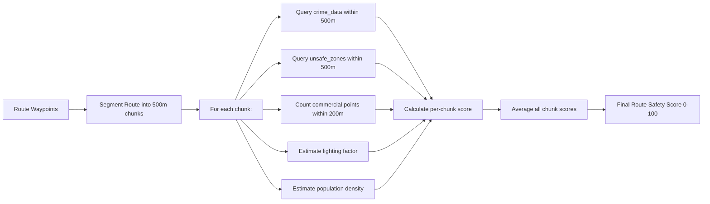

# 01 — Safety Score Algorithm

## Objective
Define the multi-factor safety scoring algorithm that evaluates route segments based on crime data, user reports, commercial density, lighting, and population.

---

## Algorithm Overview



---

## Score Components

### 1. Crime Density Score (Weight: 35%)
```
CrimeScore = 100 - (crime_count × severity_multiplier × recency_decay)

severity_multiplier:
  critical = 10
  high = 7
  medium = 4
  low = 2

recency_decay:
  < 30 days = 1.0
  30-90 days = 0.7
  90-180 days = 0.4
  180-365 days = 0.2
  > 365 days = 0.05

Minimum score: 0 (capped, never negative)
```

### 2. User Flag Score (Weight: 25%)
```
FlagScore = 100 - (verified_flags × 15 + unverified_flags × 5)

verified_flags: unsafe_zones WHERE verified = TRUE within 500m
unverified_flags: unsafe_zones WHERE verified = FALSE within 500m

Decay: flags older than 90 days have 50% weight
Minimum score: 0
```

### 3. Commercial Factor (Weight: 20%)
```
CommercialScore = min(100, commercial_points × 7)

commercial_points: Shops, ATMs, fuel stations, restaurants within 200m
Source: Google Places API (type filters: store, atm, gas_station, restaurant, hospital, police)

More commercial activity = more witnesses/help = safer
```

### 4. Lighting Factor (Weight: 10%)
```
LightingScore = based on time of day + area type

Daytime (6:00-18:00): 90 (default high)
Evening (18:00-22:00): 60 (moderate)
Night (22:00-06:00): 30 (low, unless commercial area)

Boost: +20 if commercial_points > 5 (well-lit commercial zones)
```

### 5. Population Density (Weight: 10%)
```
PopulationScore = based on area classification

Urban/commercial: 85
Suburban/residential: 65
Industrial: 40
Rural/isolated: 20
```

---

## Edge Function: `calculate-safety-score`

```typescript
serve(async (req) => {
  const { routeId } = await req.json();
  
  const supabase = createClient(
    Deno.env.get('SUPABASE_URL')!,
    Deno.env.get('SUPABASE_SERVICE_ROLE_KEY')!,
  );

  // 1. Get route waypoints
  const { data: route } = await supabase
    .from('routes')
    .select('*')
    .eq('id', routeId)
    .single();

  const waypoints = route.waypoints as Array<{lat: number, lng: number}>;

  // 2. Segment into ~500m chunks
  const chunks = segmentRoute(waypoints, 500);

  // 3. Score each chunk
  const chunkScores = await Promise.all(chunks.map(async (chunk) => {
    const [crimeScore, flagScore, commercialScore] = await Promise.all([
      calculateCrimeScore(supabase, chunk),
      calculateFlagScore(supabase, chunk),
      calculateCommercialScore(supabase, chunk),
    ]);
    
    const lightingScore = calculateLightingScore(new Date());
    const populationScore = 65; // Default suburban until Places data available

    return {
      crime: crimeScore,
      flags: flagScore,
      commercial: commercialScore,
      lighting: lightingScore,
      population: populationScore,
      weighted: (crimeScore * 0.35) + (flagScore * 0.25) + 
                (commercialScore * 0.20) + (lightingScore * 0.10) + 
                (populationScore * 0.10),
    };
  }));

  // 4. Average all chunk scores
  const overallScore = chunkScores.reduce((sum, c) => sum + c.weighted, 0) / chunkScores.length;

  // 5. Update route with score
  await supabase
    .from('routes')
    .update({
      safety_score: Math.round(overallScore * 10) / 10,
      status: 'scored',
      safety_breakdown: {
        overall_score: overallScore,
        components: {
          crime_density_score: avg(chunkScores.map(c => c.crime)),
          user_flag_score: avg(chunkScores.map(c => c.flags)),
          commercial_factor: avg(chunkScores.map(c => c.commercial)),
          lighting_factor: avg(chunkScores.map(c => c.lighting)),
          population_density: avg(chunkScores.map(c => c.population)),
        },
        weights: { crime_density: 0.35, user_flags: 0.25, commercial: 0.20, lighting: 0.10, population: 0.10 },
        chunk_count: chunks.length,
      },
    })
    .eq('id', routeId);

  return new Response(JSON.stringify({ score: overallScore }));
});

function segmentRoute(waypoints: Array<{lat: number, lng: number}>, segmentMeters: number) {
  // Split waypoints array into chunks of ~segmentMeters distance
  const chunks: Array<{centerLat: number, centerLng: number}> = [];
  let distance = 0;
  let lastPoint = waypoints[0];

  for (const point of waypoints) {
    distance += haversineDistance(lastPoint, point);
    if (distance >= segmentMeters) {
      chunks.push({ centerLat: point.lat, centerLng: point.lng });
      distance = 0;
    }
    lastPoint = point;
  }
  if (chunks.length === 0) chunks.push({ centerLat: waypoints[0].lat, centerLng: waypoints[0].lng });
  return chunks;
}
```

---

## Database Trigger: Auto-Score on Route Creation

```sql
-- When a route is inserted, trigger safety scoring
CREATE OR REPLACE FUNCTION trigger_safety_scoring()
RETURNS TRIGGER AS $$
BEGIN
    -- Call Edge Function via pg_net (async HTTP)
    PERFORM net.http_post(
        url := current_setting('app.supabase_url') || '/functions/v1/calculate-safety-score',
        headers := jsonb_build_object(
            'Content-Type', 'application/json',
            'Authorization', 'Bearer ' || current_setting('app.service_role_key')
        ),
        body := jsonb_build_object('routeId', NEW.id)
    );
    RETURN NEW;
END;
$$ LANGUAGE plpgsql;

CREATE TRIGGER auto_score_route
    AFTER INSERT ON public.routes
    FOR EACH ROW
    EXECUTE FUNCTION trigger_safety_scoring();
```

---

## Verification
- [ ] Routes segmented into ~500m chunks
- [ ] Crime density calculated with severity weighting
- [ ] User flag count affects score
- [ ] Time-of-day affects lighting factor
- [ ] Score stored in `safety_score` + `safety_breakdown`
- [ ] Route status updated to `scored`
- [ ] Supabase Realtime updates UI when score arrives
