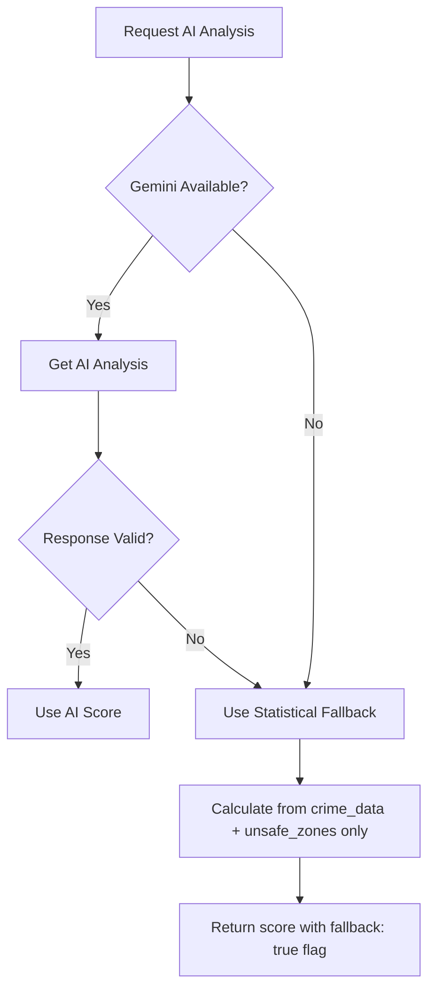

# 02 — Gemini AI Integration

## Objective
Integrate Google Gemini AI to analyze crime data, generate crime intelligence from news sources, and provide AI-powered safety assessments for route segments.

---

## Two AI Use Cases

### Use Case 1: Crime Data Analysis
Analyze structured crime incident data near a route to assess risk.

### Use Case 2: AI-Aggregated Crime News
Search and analyze recent crime news for a geographic area to supplement official data.

---

## Prompt Engineering

### Crime Analysis Prompt

```typescript
function buildCrimeAnalysisPrompt(routeData: any, crimeData: any[]) {
  return `You are a safety analysis AI for a personal safety navigation app.

TASK: Analyze the following crime data near a route and provide a structured safety assessment.

ROUTE INFORMATION:
- Start: (${routeData.originLat}, ${routeData.originLng})
- End: (${routeData.destLat}, ${routeData.destLng})
- Distance: ${routeData.distanceKm} km
- Estimated Duration: ${routeData.durationMin} minutes
- Time of Travel: ${new Date().toISOString()}

CRIME DATA (within 500m of route):
${JSON.stringify(crimeData, null, 2)}

INSTRUCTIONS:
1. Assess the overall risk level for this route
2. Identify high-risk segments
3. Suggest precautions
4. Rate the route safety from 0-100

RESPOND IN THIS EXACT JSON FORMAT:
{
  "risk_level": "low|medium|high|critical",
  "safety_rating": <number 0-100>,
  "high_risk_segments": [
    {
      "lat": <number>,
      "lng": <number>,
      "reason": "<string>",
      "severity": "low|medium|high|critical"
    }
  ],
  "precautions": ["<string>"],
  "summary": "<one paragraph summary>",
  "confidence": <number 0-1>
}

IMPORTANT: Respond ONLY with valid JSON. No markdown, no explanations outside the JSON.`;
}
```

### Crime News Prompt

```typescript
function buildCrimeNewsPrompt(lat: number, lng: number, radiusKm: number) {
  return `You are a crime intelligence analyst.

TASK: Based on your knowledge, identify any notable crime patterns, incidents, or safety concerns in the area around coordinates (${lat}, ${lng}) within a ${radiusKm}km radius.

Focus on:
- Recent crime trends (last 6 months)
- Common crime types in this area
- Time-based patterns (night vs day)
- Seasonal patterns

RESPOND IN THIS EXACT JSON FORMAT:
{
  "area_assessment": "low_risk|moderate_risk|high_risk",
  "crime_patterns": [
    {
      "type": "<crime type>",
      "frequency": "rare|occasional|common",
      "time_pattern": "<when it typically occurs>",
      "details": "<brief description>"
    }
  ],
  "safety_tips": ["<string>"],
  "confidence": <number 0-1>,
  "data_freshness": "<how recent the information is>"
}`;
}
```

---

## Edge Function: `ai-crime-analysis`

```typescript
// supabase/functions/ai-crime-analysis/index.ts
import { GoogleGenerativeAI } from '@google/generative-ai';

serve(async (req) => {
  const { routeId, routeData, crimeData } = await req.json();
  
  const apiKey = Deno.env.get('GEMINI_API_KEY')!;
  const genAI = new GoogleGenerativeAI(apiKey);
  const model = genAI.getGenerativeModel({ model: 'gemini-1.5-flash' });

  try {
    // 1. Build prompt
    const prompt = buildCrimeAnalysisPrompt(routeData, crimeData);

    // 2. Call Gemini
    const result = await model.generateContent(prompt);
    const responseText = result.response.text();

    // 3. Parse response (extract JSON)
    let analysis;
    try {
      // Try to extract JSON from response
      const jsonMatch = responseText.match(/\{[\s\S]*\}/);
      if (jsonMatch) {
        analysis = JSON.parse(jsonMatch[0]);
      } else {
        throw new Error('No JSON found in response');
      }
    } catch (parseError) {
      // AI response not parseable — use fallback
      return new Response(JSON.stringify({
        error: 'ai_parse_error',
        fallback: true,
        safety_rating: 70, // Default moderate safety
      }), { status: 200 });
    }

    // 4. Validate response schema
    if (!validateAnalysisSchema(analysis)) {
      return new Response(JSON.stringify({
        error: 'invalid_schema',
        fallback: true,
        safety_rating: 70,
      }), { status: 200 });
    }

    // 5. Store analysis result
    const supabase = createClient(
      Deno.env.get('SUPABASE_URL')!,
      Deno.env.get('SUPABASE_SERVICE_ROLE_KEY')!,
    );

    await supabase.from('ai_analyses').insert({
      route_id: routeId,
      analysis_type: 'crime_analysis',
      prompt_tokens: result.response.usageMetadata?.promptTokenCount,
      response_tokens: result.response.usageMetadata?.candidatesTokenCount,
      result: analysis,
      model_used: 'gemini-1.5-flash',
    });

    return new Response(JSON.stringify(analysis));
  } catch (error) {
    // Gemini API failed — return fallback
    return new Response(JSON.stringify({
      error: 'ai_unavailable',
      fallback: true,
      safety_rating: 70,
      message: 'AI analysis unavailable, using statistical fallback',
    }), { status: 200 });
  }
});

function validateAnalysisSchema(data: any): boolean {
  return (
    typeof data.risk_level === 'string' &&
    ['low', 'medium', 'high', 'critical'].includes(data.risk_level) &&
    typeof data.safety_rating === 'number' &&
    data.safety_rating >= 0 && data.safety_rating <= 100 &&
    Array.isArray(data.high_risk_segments) &&
    Array.isArray(data.precautions) &&
    typeof data.summary === 'string' &&
    typeof data.confidence === 'number'
  );
}
```

---

## AI Analysis Cache Table

```sql
CREATE TABLE public.ai_analyses (
    id UUID PRIMARY KEY DEFAULT uuid_generate_v4(),
    route_id UUID REFERENCES public.routes(id),
    analysis_type VARCHAR(50) NOT NULL,
    prompt_tokens INTEGER,
    response_tokens INTEGER,
    result JSONB NOT NULL,
    model_used VARCHAR(50),
    cached_at TIMESTAMPTZ DEFAULT NOW(),
    expires_at TIMESTAMPTZ DEFAULT NOW() + INTERVAL '6 hours'
);

CREATE INDEX idx_ai_analyses_route ON public.ai_analyses(route_id);
```

---

## Fallback Strategy



When AI is unavailable, the safety score uses only the statistical components (crime density + user flags + commercial points) without AI enhancement.

---

## Prompt Injection Prevention

> [!CAUTION]
> Never include user-generated text directly in AI prompts without sanitization.

```typescript
function sanitizeForPrompt(text: string): string {
  // Remove any potential prompt injection patterns
  return text
    .replace(/INSTRUCTIONS?:/gi, '')
    .replace(/SYSTEM:/gi, '')
    .replace(/IGNORE .*/gi, '')
    .replace(/```/g, '')
    .slice(0, 500); // Max 500 chars
}
```

---

## Verification
- [ ] Gemini API called with structured prompt
- [ ] Response parsed and validated against schema
- [ ] Invalid responses trigger fallback scoring
- [ ] AI unavailability handled gracefully
- [ ] Analysis results cached (6hr TTL)
- [ ] Token usage tracked for cost monitoring
- [ ] Prompt injection patterns sanitized
