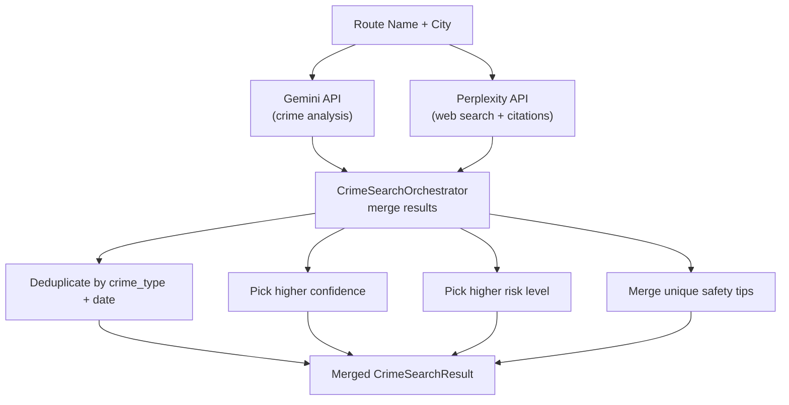
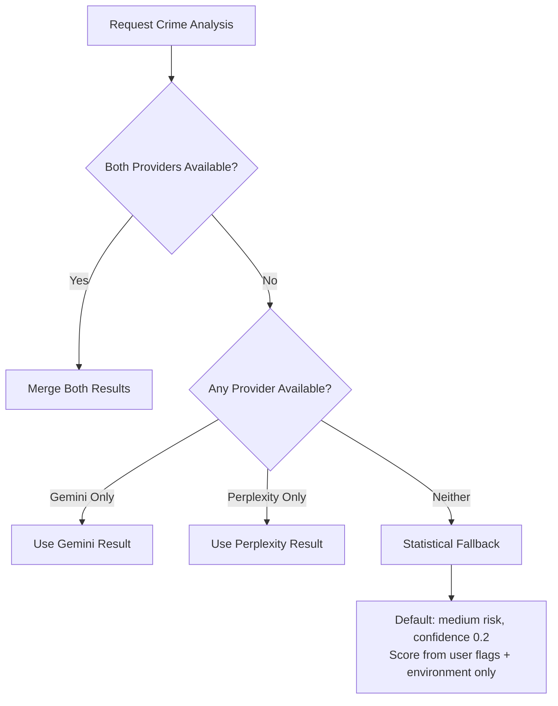

# 02 — Gemini & Perplexity AI Integration

## Objective
Integrate both Google Gemini AI and Perplexity AI to analyze crime data through web search and AI analysis, providing dual-sourced safety assessments for route segments.

---

## Three AI Use Cases

### Use Case 1: Crime Data Analysis (Gemini)
Analyze crime patterns and provide structured risk assessments for route areas.

### Use Case 2: Web-Grounded Crime Search (Perplexity)
Search the web for recent crime news articles along a route, returning cited sources.

### Use Case 3: Combined Analysis (Orchestrator)
Call both providers in parallel, merge results for comprehensive coverage.

---

## Prompt Engineering

### Gemini Crime Analysis Prompt

```
You are a crime intelligence analyst for an Indian women's safety navigation app.

TASK: Research and analyze crime incidents reported along or near the following route/area.

ROUTE/AREA: {routeName}
CITY/REGION: {city}

Search for: kidnapping, rape, sexual assault, missing persons, robbery,
chain snatching, eve teasing, stalking, murder, acid attacks, harassment.

RESPOND IN JSON:
{
  "area_name": "<string>",
  "incidents_found": <number>,
  "crime_reports": [
    {"crime_type": "...", "severity": "critical|high|medium|low",
     "approximate_date": "YYYY-MM", "description": "..."}
  ],
  "overall_risk": "low|medium|high|critical",
  "confidence": <0-1>,
  "summary": "<assessment>",
  "safety_tips": ["<tip1>", "<tip2>"]
}
```

### Perplexity Web Search Prompt

```
Search the web for crime incidents reported along or near "{routeName}" in {city}, India.

Look for: kidnapping, rape, sexual assault, missing persons, robbery,
chain snatching, eve teasing, stalking, murder, acid attacks.

Respond in JSON with sources/citations.
```

---

## API Configuration

### Gemini API
- **Model**: `gemini-2.0-flash`
- **Endpoint**: `generativelanguage.googleapis.com/v1beta`
- **Temperature**: 0.2 (factual responses)
- **Response format**: `application/json`

### Perplexity API
- **Model**: `sonar` (web search optimized)
- **Endpoint**: `api.perplexity.ai/chat/completions`
- **Recency filter**: `year` (last 12 months)
- **Temperature**: 0.2

---

## Dual-Provider Merge Strategy



---

## Fallback Strategy



---

## Prompt Injection Prevention

> [!CAUTION]
> Route names come from Google Maps and are generally safe, but always sanitize.

The `InputValidator.sanitizeAiPrompt()` utility (Phase 9) strips injection patterns before including any user-contributed text in prompts.

---

## Verification
- [x] Gemini API called with structured crime analysis prompt
- [x] Perplexity API called with web search prompt
- [x] Both responses parsed and validated
- [x] Invalid responses trigger fallback
- [x] Dual-provider results merged correctly
- [x] Token usage tracked for cost monitoring
- [x] Prompt injection patterns sanitized
