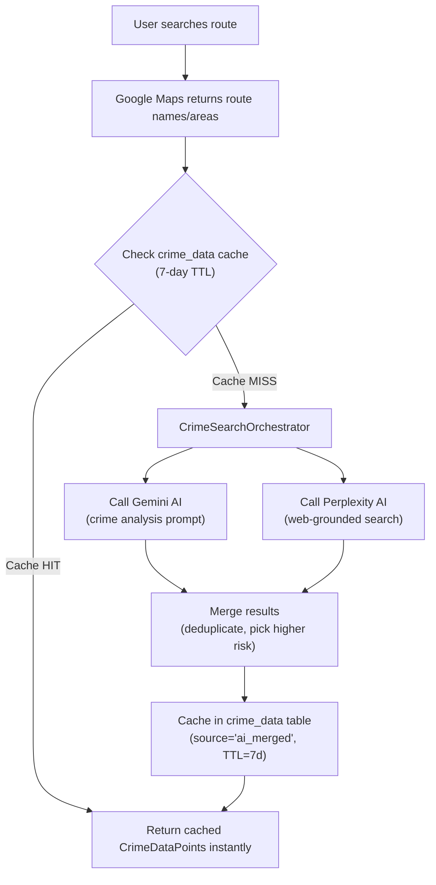

# 03 — Crime Data Pipeline

## Objective
Build a system to source, analyze, and cache crime data from AI web search to feed the safety scoring algorithm. Future-proofed for government data integration.

---

## Data Sources

| Source | Type | Method | Status |
|--------|------|--------|--------|
| **Gemini AI** | AI crime analysis | Direct API call | ✅ Active |
| **Perplexity AI** | Web-grounded search | Direct API call | ✅ Active |
| User flags | Crowdsourced | Real-time in-app | ✅ Active |
| Government police APIs | Official records | API/CSV import | 🔮 Future |
| Open data portals | Public datasets | CSV/JSON import | 🔮 Future |

---

## AI Crime Search Flow



---

## Crime Types Searched

The AI providers are prompted to search for these India-specific crime types:

| Crime Type | Severity | Impact Score |
|-----------|----------|-------------|
| Murder, Rape, Kidnapping, Acid attack | **Critical** | 10× |
| Armed robbery, Assault, Sexual harassment | **High** | 7× |
| Chain snatching, Theft, Stalking | **Medium** | 4× |
| Eve teasing, Verbal harassment | **Low** | 2× |

---

## Dual-Provider Architecture

### Gemini (`GeminiCrimeSearchService`)
- Uses `gemini-2.0-flash` model
- Structured JSON response via `responseMimeType`
- Best for: analytical crime pattern assessment

### Perplexity (`PerplexityCrimeSearchService`)
- Uses `sonar` model with `search_recency_filter: year`
- Web-grounded with citations from news sources
- Best for: finding recent real crime news articles

### Orchestrator (`CrimeSearchOrchestrator`)
- Calls **both providers in parallel** for speed
- Merges results: deduplicates crime reports, picks higher confidence
- Caches merged result in `crime_data` table with 7-day TTL
- If both fail: returns fallback (medium risk, low confidence)

---

## Cache Schema (`crime_data` table)

```sql
CREATE TABLE public.crime_data (
    id UUID PRIMARY KEY DEFAULT uuid_generate_v4(),
    location GEOMETRY(POINT, 4326),
    crime_type VARCHAR(100) NOT NULL,
    severity TEXT CHECK (severity IN ('low','medium','high','critical')),
    description TEXT,
    source VARCHAR(100),      -- 'ai_gemini', 'ai_perplexity', 'ai_merged', 'government'
    route_name VARCHAR(500),  -- For cache lookup
    city VARCHAR(200),
    occurred_at TIMESTAMPTZ,
    ai_confidence FLOAT,
    expires_at TIMESTAMPTZ DEFAULT NOW() + INTERVAL '7 days',
    metadata JSONB DEFAULT '{}',
    created_at TIMESTAMPTZ DEFAULT NOW()
);
```

---

## Future: Government Data Integration

When official police/government crime data becomes available:

1. Add `source = 'government'` records with higher confidence (0.95)
2. The scoring algorithm automatically weighs them higher
3. AI data supplements gaps in official coverage
4. No code changes needed — the `source` column distinguishes origin

---

## Verification
- [x] Gemini crime search returns structured JSON
- [x] Perplexity web search returns cited crime reports
- [x] Orchestrator calls both in parallel and merges
- [x] Results cached in crime_data with 7-day TTL
- [x] Cache hit returns instantly, no API call
- [x] Both-provider failure returns graceful fallback
- [ ] Government data source integration (future)
