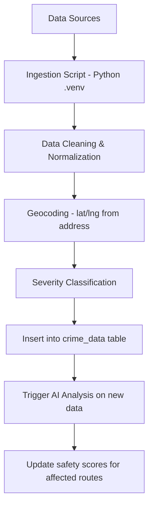

# 03 — Crime Data Pipeline

## Objective
Build a system to ingest, process, and maintain crime data from external sources to feed the safety scoring algorithm.

---

## Data Sources

| Source | Type | Method | Frequency |
|--------|------|--------|-----------|
| Government police APIs | Official records | API/CSV import | Weekly |
| AI news aggregation | Crime news | Gemini analysis | Daily |
| User flags | Crowdsourced | Real-time | Continuous |
| Open data portals | Public datasets | CSV/JSON import | Monthly |

---

## Ingestion Flow



---

## Python Ingestion Script

### `scripts/crime_data_ingestion.py`

```python
import json
import hashlib
from datetime import datetime
from supabase import create_client, Client
import requests

def ingest_crime_data(data_file: str, source: str):
    """Ingest crime data from a JSON file into Supabase."""
    supabase: Client = create_client(
        os.environ['SUPABASE_URL'],
        os.environ['SUPABASE_SERVICE_ROLE_KEY']
    )
    
    with open(data_file) as f:
        records = json.load(f)
    
    for record in records:
        # 1. Geocode address if no coordinates
        if 'lat' not in record:
            coords = geocode_address(record['address'])
            record['lat'] = coords['lat']
            record['lng'] = coords['lng']
        
        # 2. Classify severity
        severity = classify_severity(record['crime_type'])
        
        # 3. Generate dedup hash
        dedup_key = hashlib.md5(
            f"{record['lat']:.4f}_{record['lng']:.4f}_{record['crime_type']}_{record.get('date', '')}".encode()
        ).hexdigest()
        
        # 4. Insert (skip duplicates)
        supabase.table('crime_data').upsert({
            'location': f"POINT({record['lng']} {record['lat']})",
            'crime_type': record['crime_type'],
            'severity': severity,
            'description': record.get('description', ''),
            'source': source,
            'occurred_at': record.get('date'),
            'metadata': {'dedup_key': dedup_key, 'raw': record},
        }, on_conflict='id').execute()

def classify_severity(crime_type: str) -> str:
    """Classify crime severity based on type."""
    critical = ['murder', 'homicide', 'kidnapping', 'rape', 'armed_robbery']
    high = ['assault', 'robbery', 'carjacking', 'shooting']
    medium = ['burglary', 'theft', 'vandalism', 'drug_offense']
    
    crime_lower = crime_type.lower()
    if any(c in crime_lower for c in critical): return 'critical'
    if any(c in crime_lower for c in high): return 'high'
    if any(c in crime_lower for c in medium): return 'medium'
    return 'low'
```

---

## Data Decay

Crime data relevance decreases over time. Apply a temporal decay:

```sql
-- Materialized view for decayed crime impact
CREATE MATERIALIZED VIEW crime_impact AS
SELECT
    id,
    location,
    crime_type,
    severity,
    occurred_at,
    CASE severity
        WHEN 'critical' THEN 10
        WHEN 'high' THEN 7
        WHEN 'medium' THEN 4
        WHEN 'low' THEN 2
    END *
    CASE
        WHEN occurred_at > NOW() - INTERVAL '30 days' THEN 1.0
        WHEN occurred_at > NOW() - INTERVAL '90 days' THEN 0.7
        WHEN occurred_at > NOW() - INTERVAL '180 days' THEN 0.4
        WHEN occurred_at > NOW() - INTERVAL '365 days' THEN 0.2
        ELSE 0.05
    END AS impact_score
FROM crime_data;

-- Refresh daily via pg_cron
SELECT cron.schedule('refresh-crime-impact', '0 3 * * *', 'REFRESH MATERIALIZED VIEW crime_impact');
```

---

## Verification
- [ ] Ingestion script processes CSV/JSON data files
- [ ] Geocoding converts addresses to coordinates
- [ ] Severity auto-classified from crime type
- [ ] Duplicate detection prevents re-ingestion
- [ ] Temporal decay reduces old crime impact
- [ ] Materialized view refreshes daily
