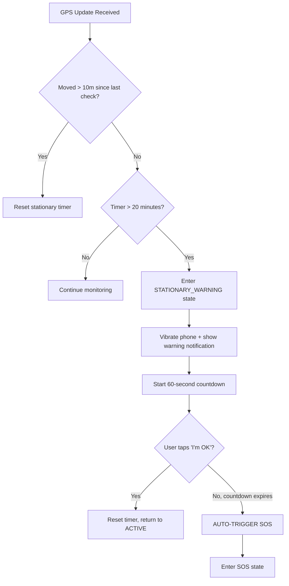

# 03 — Stationary Deadman Switch

## Objective
Detect when a user hasn't moved for 20 minutes, warn them, and auto-trigger SOS if they don't respond within 60 seconds.

---

## Logic Flow



## Implementation

```dart
class DeadmanSwitchService {
  static const int stationaryThresholdMinutes = 20;
  static const int countdownSeconds = 60;
  static const double movementThresholdMeters = 10;

  Timer? _stationaryTimer;
  Timer? _countdownTimer;
  int _countdownRemaining = countdownSeconds;
  Position? _lastKnownPosition;
  final Function() onStationaryWarning;
  final Function() onAutoSOS;
  final Function(int secondsRemaining) onCountdownTick;

  DeadmanSwitchService({
    required this.onStationaryWarning,
    required this.onAutoSOS,
    required this.onCountdownTick,
  });

  void start() {
    _resetStationaryTimer();
  }

  void onPositionUpdate(Position position) {
    if (_lastKnownPosition != null) {
      final distance = Geolocator.distanceBetween(
        _lastKnownPosition!.latitude, _lastKnownPosition!.longitude,
        position.latitude, position.longitude,
      );

      if (distance > movementThresholdMeters) {
        _resetStationaryTimer();
      }
    }
    _lastKnownPosition = position;
  }

  void _resetStationaryTimer() {
    _stationaryTimer?.cancel();
    _countdownTimer?.cancel();
    _stationaryTimer = Timer(
      Duration(minutes: stationaryThresholdMinutes),
      _onStationaryTimeout,
    );
  }

  void _onStationaryTimeout() {
    onStationaryWarning();
    _startCountdown();
  }

  void _startCountdown() {
    _countdownRemaining = countdownSeconds;
    _countdownTimer = Timer.periodic(Duration(seconds: 1), (timer) {
      _countdownRemaining--;
      onCountdownTick(_countdownRemaining);
      
      if (_countdownRemaining <= 0) {
        timer.cancel();
        onAutoSOS(); // Triggers Phase 6 SOS
      }
    });
  }

  void userConfirmedOK() {
    _countdownTimer?.cancel();
    _resetStationaryTimer();
  }

  void pause() {
    _stationaryTimer?.cancel();
    _countdownTimer?.cancel();
  }

  void stop() {
    _stationaryTimer?.cancel();
    _countdownTimer?.cancel();
    _lastKnownPosition = null;
  }
}
```

## Warning UI

```
┌─────────────────────────────────┐
│  ⚠️ ARE YOU OKAY?               │
│                                 │
│  You haven't moved for          │
│  20 minutes.                    │
│                                 │
│  Auto-SOS in: [0:45]            │
│     ████████████░░░░░░░         │
│                                 │
│  [ I'M OKAY ✓ ]                │
│                                 │
│  If you don't respond,          │
│  emergency contacts will        │
│  be alerted.                    │
└─────────────────────────────────┘
```

Accompanied by:
- **Vibration**: Repeated pattern every 5 seconds
- **Notification**: High-priority push notification with sound
- **Screen wake**: Wake lock to display warning

---

## Verification
- [ ] Timer starts when journey begins
- [ ] Resets on movement > 10 meters
- [ ] Warning after 20 min stationary
- [ ] 60-second countdown visible on screen
- [ ] "I'm OK" resets everything
- [ ] Auto-SOS triggers if countdown expires
- [ ] Works when app is in background
