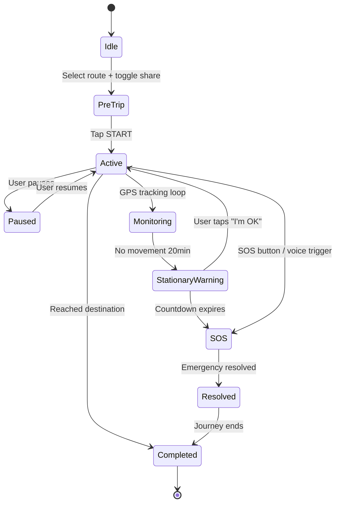

# Phase 05 — Live Monitoring Engine

## Objective
Build the active safety monitoring system — GPS tracking during journeys, deadman switch, voice-activated SOS, route deviation detection, and battery-optimized background services.

## Prerequisites
- Phase 4 complete (Routes scored and selectable)
- Background location permissions configured (Phase 1)
- Microphone permission configured (Phase 1)

## Deliverables
| # | Deliverable | Detailed File |
|---|-------------|---------------|
| 1 | Journey state machine | [01_journey_state_machine.md](./01_journey_state_machine.md) |
| 2 | GPS tracking service | [02_gps_tracking_service.md](./02_gps_tracking_service.md) |
| 3 | Stationary deadman switch | [03_stationary_deadman_switch.md](./03_stationary_deadman_switch.md) |
| 4 | Voice trigger system | [04_voice_trigger_system.md](./04_voice_trigger_system.md) |
| 5 | Route deviation detection | [05_route_deviation_detection.md](./05_route_deviation_detection.md) |
| 6 | Movement smoothing | [06_movement_smoothing.md](./06_movement_smoothing.md) |
| 7 | Battery optimization | [07_battery_optimization.md](./07_battery_optimization.md) |

## Database Schema (Phase 5)
```sql
CREATE TABLE public.journeys (
    id UUID PRIMARY KEY DEFAULT uuid_generate_v4(),
    user_id UUID NOT NULL REFERENCES auth.users(id),
    route_id UUID REFERENCES public.routes(id),
    origin GEOMETRY(POINT, 4326) NOT NULL,
    destination GEOMETRY(POINT, 4326) NOT NULL,
    status TEXT DEFAULT 'active'
        CHECK (status IN ('active', 'paused', 'completed', 'sos', 'cancelled')),
    started_at TIMESTAMPTZ DEFAULT NOW(),
    completed_at TIMESTAMPTZ,
    share_live_location BOOLEAN DEFAULT FALSE,
    tracking_link_id VARCHAR(50),
    metadata JSONB DEFAULT '{}',
    created_at TIMESTAMPTZ DEFAULT NOW()
);

CREATE TABLE public.journey_points (
    id UUID PRIMARY KEY DEFAULT uuid_generate_v4(),
    journey_id UUID NOT NULL REFERENCES public.journeys(id) ON DELETE CASCADE,
    location GEOMETRY(POINT, 4326) NOT NULL,
    accuracy FLOAT,
    speed FLOAT,             -- m/s
    heading FLOAT,           -- degrees
    battery_level FLOAT,
    recorded_at TIMESTAMPTZ DEFAULT NOW()
);

-- Spatial index for efficient queries
CREATE INDEX idx_journey_points_journey_id ON public.journey_points(journey_id);
CREATE INDEX idx_journey_points_location ON public.journey_points USING GIST (location);
CREATE INDEX idx_journey_points_recorded ON public.journey_points(recorded_at);

-- RLS
ALTER TABLE public.journeys ENABLE ROW LEVEL SECURITY;
ALTER TABLE public.journey_points ENABLE ROW LEVEL SECURITY;

CREATE POLICY "Users manage own journeys" ON public.journeys FOR ALL USING (auth.uid() = user_id);
CREATE POLICY "Users manage own journey points" ON public.journey_points FOR ALL
    USING (journey_id IN (SELECT id FROM public.journeys WHERE user_id = auth.uid()));
```

## Journey State Machine



## Security Checkpoints (Phase 5)
- [ ] Location data encrypted in transit
- [ ] Background service permissions properly declared
- [ ] Journey points retention policy (30 days)
- [ ] battery-aware GPS interval adjustment

## Git Branch
```bash
git checkout -b phase/05-live-monitoring
```

## Verification Criteria
- [ ] Journey starts and GPS tracking activates
- [ ] Points recorded every 5 seconds
- [ ] Deadman switch triggers after 20 min stationary
- [ ] Voice trigger detects keyword
- [ ] Route deviation alerts user
- [ ] Battery optimization reduces GPS frequency when appropriate
