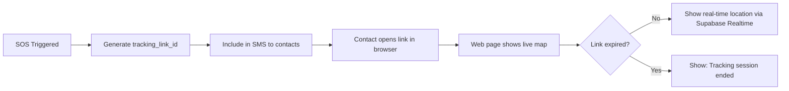

# 04 — Public Tracking Link

## Objective
Generate time-limited public links that allow emergency contacts to track a user's live location without requiring app installation.

---

## Flow



## Web Tracking Page

Hosted as Supabase Edge Function or static page:

```
https://resqroute.app/track/{tracking_link_id}
```

### UI (Minimal Web Page)
```
┌─────────────────────────────────┐
│  🚨 Live Emergency Tracking     │
│                                 │
│  [User Name] triggered SOS     │
│  at [Time]                     │
│                                 │
│  ┌─────────────────────────┐   │
│  │                         │   │
│  │    [Google Map]         │   │
│  │    📍 Current Location   │   │
│  │    🔴 SOS Trigger Point  │   │
│  │    ─── Trail             │   │
│  │                         │   │
│  └─────────────────────────┘   │
│                                 │
│  Last updated: 5 seconds ago   │
│                                 │
│  📞 Emergency: Call 112         │
│                                 │
│  This link expires in 23:45:12  │
└─────────────────────────────────┘
```

## Implementation

### Edge Function: `track-location`
```typescript
serve(async (req) => {
  const url = new URL(req.url);
  const trackingId = url.pathname.split('/').pop();

  const supabase = createClient(
    Deno.env.get('SUPABASE_URL')!,
    Deno.env.get('SUPABASE_SERVICE_ROLE_KEY')!,
  );

  // Validate tracking link
  const { data: sosEvent } = await supabase
    .from('sos_events')
    .select('*, journeys(*), user_profiles(full_name)')
    .eq('tracking_link_id', trackingId)
    .single();

  if (!sosEvent || new Date(sosEvent.tracking_link_expires_at) < new Date()) {
    return new Response(renderExpiredPage(), {
      headers: { 'Content-Type': 'text/html' },
    });
  }

  // Return HTML page with embedded Supabase Realtime subscription
  return new Response(renderTrackingPage(sosEvent), {
    headers: { 'Content-Type': 'text/html' },
  });
});
```

### Real-time Updates
The web page connects to Supabase Realtime channel for live updates:

```javascript
// In the tracking page JavaScript:
const channel = supabase.channel(`journey:${journeyId}`);
channel.on('broadcast', { event: 'location_update' }, (payload) => {
  updateMapMarker(payload.lat, payload.lng);
});
channel.subscribe();
```

## Security
- Links expire after **24 hours**
- No authentication required (public access by design)
- Only shows location — no personal data beyond first name
- Link can be manually deactivated by user

---

## Verification
- [ ] Tracking link generated with unique ID
- [ ] Web page renders with map
- [ ] Real-time location updates work
- [ ] Expired links show appropriate message
- [ ] No PII exposed beyond first name and location
