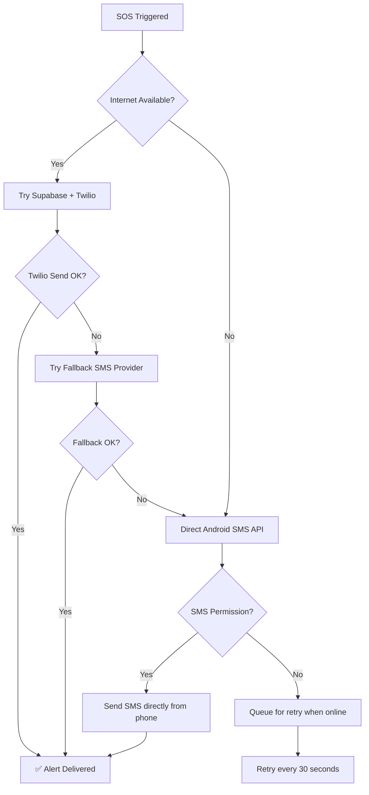

# 05 — Fallback Mechanisms

## Objective
Ensure emergency alerts are delivered even when primary services (Twilio, Supabase, Internet) fail.

---

## Fallback Hierarchy



## Direct Device SMS (No Internet Fallback)

```dart
class DirectSMSService {
  Future<void> sendDirectSMS({
    required List<EmergencyContactModel> contacts,
    required double lat,
    required double lng,
  }) async {
    // Uses platform channel to send SMS directly
    for (final contact in contacts) {
      final message = '🚨 SOS from ResQ Route! '
          'Location: https://maps.google.com/?q=$lat,$lng '
          'Time: ${DateTime.now().toIso8601String()} '
          'CALL 112 IF CONCERNED';
      
      // Use Android SMS Manager or telephony package
      await telephony.sendSms(
        to: '+91${contact.phone}',
        message: message,
      );
    }
  }
}
```

> [!CAUTION]
> Direct SMS requires `SEND_SMS` permission. This is a sensitive permission that needs clear justification in app store review.

## Offline Queue

```dart
class OfflineSOSQueue {
  final SharedPreferences _prefs;
  
  Future<void> queueSOS(Map<String, dynamic> sosData) async {
    final queue = _getQueue();
    queue.add(sosData);
    await _prefs.setString('sos_queue', json.encode(queue));
  }

  Future<void> processQueue() async {
    final queue = _getQueue();
    for (final sos in queue) {
      try {
        await _sendToServer(sos);
        queue.remove(sos);
      } catch (e) {
        break; // Still offline, try again later
      }
    }
    await _prefs.setString('sos_queue', json.encode(queue));
  }
}
```

---

## Verification
- [ ] Twilio failure triggers fallback provider
- [ ] No internet triggers direct SMS
- [ ] Offline SOS queued for retry
- [ ] Queue processed when connectivity restored
- [ ] At least one delivery method succeeds
