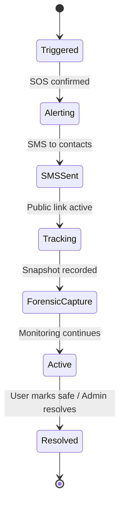

# Phase 06 — Emergency Response System

## Objective
Build the complete emergency response system — SOS triggers, SMS alerts via Twilio, forensic snapshots, emergency services integration, public tracking links, and robust fallback mechanisms.

## Prerequisites
- Phase 5 complete (Journey tracking active, deadman switch working)
- Twilio account with SMS-capable number
- Emergency contacts saved (Phase 2)

## Deliverables
| # | Deliverable | Detailed File |
|---|-------------|---------------|
| 1 | SOS trigger mechanisms | [01_sos_trigger_mechanisms.md](./01_sos_trigger_mechanisms.md) |
| 2 | Twilio SMS alerting | [02_twilio_sms_alerting.md](./02_twilio_sms_alerting.md) |
| 3 | Forensic snapshot capture | [03_forensic_snapshot.md](./03_forensic_snapshot.md) |
| 4 | Public tracking link | [04_public_tracking_link.md](./04_public_tracking_link.md) |
| 5 | Fallback mechanisms | [05_fallback_mechanisms.md](./05_fallback_mechanisms.md) |

## SOS Lifecycle



## SOS Trigger Methods
1. **SOS Button** — Prominent on journey screen (3-second hold or double-tap)
2. **Voice Trigger** — "HELP SAFE APP" keyword (Phase 5)
3. **Deadman Switch** — Auto-trigger after stationary countdown (Phase 5)
4. **Shake Trigger** — Rapid phone shaking (optional)

## SMS Alert Template
```
🚨 SOS ALERT from [User Name]
Location: https://maps.google.com/?q={lat},{lng}
Sent via ResQ Route at {time}
Track live: {tracking_link}
If concerned, call 112 or go to them immediately.
```

## Database Schema (Phase 6)
```sql
CREATE TABLE public.sos_events (
    id UUID PRIMARY KEY DEFAULT uuid_generate_v4(),
    journey_id UUID REFERENCES public.journeys(id),
    user_id UUID NOT NULL REFERENCES auth.users(id),
    trigger_type TEXT NOT NULL CHECK (trigger_type IN ('button', 'voice', 'deadman', 'shake')),
    location GEOMETRY(POINT, 4326),
    status TEXT DEFAULT 'active' CHECK (status IN ('active', 'resolved', 'false_alarm')),
    resolved_at TIMESTAMPTZ,
    resolved_by TEXT,           -- 'user', 'admin', 'system'
    forensic_snapshot_url TEXT,
    tracking_link_id VARCHAR(50) UNIQUE,
    tracking_link_expires_at TIMESTAMPTZ,
    sms_delivery_status JSONB DEFAULT '{}',
    metadata JSONB DEFAULT '{}',
    created_at TIMESTAMPTZ DEFAULT NOW()
);

-- RLS: Users view own, admins view all
ALTER TABLE public.sos_events ENABLE ROW LEVEL SECURITY;
CREATE POLICY "Users view own SOS" ON public.sos_events FOR SELECT USING (auth.uid() = user_id);
```

## Security Checkpoints (Phase 6)
- [ ] SOS cannot be accidentally triggered (hold/double-tap confirmation)
- [ ] Public tracking links expire after 24 hours
- [ ] Forensic data immutable once captured
- [ ] SMS retry with exponential backoff
- [ ] Fallback SMS provider if Twilio fails

## Git Branch
```bash
git checkout -b phase/06-emergency-response
```

## Verification Criteria
- [ ] SOS button triggers full alert flow
- [ ] SMS sent to all 3 emergency contacts
- [ ] Public tracking link shows live location
- [ ] Forensic snapshot captured and stored
- [ ] Resolve flow marks SOS as resolved
- [ ] Fallback works when primary SMS fails
