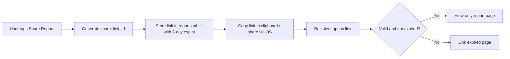

# 04 — Share Link System

## Objective
Generate time-limited shareable links for SRR reports that provide view-only access.

---

## Flow



## Implementation

```dart
class ReportShareService {
  Future<String> generateShareLink(String reportId) async {
    final linkId = _generateLinkId();
    
    await Supabase.instance.client.from('reports').update({
      'share_link_id': linkId,
      'share_link_expires_at': DateTime.now().add(Duration(days: 7)).toIso8601String(),
    }).eq('id', reportId);

    return 'https://resqroute.app/report/$linkId';
  }

  String _generateLinkId() {
    final rng = Random.secure();
    return List.generate(24, (_) => 'abcdefghijklmnopqrstuvwxyz0123456789'[rng.nextInt(36)]).join();
  }
}
```

## Web View Page

Served via Edge Function — renders a read-only version of the SRR:
- Journey summary
- Map snapshot
- Safety score
- No editable fields
- Download PDF option

---

## Verification
- [ ] Share link generated with unique ID
- [ ] Link expires after 7 days
- [ ] View-only page renders report
- [ ] Expired link shows appropriate message
- [ ] PDF downloadable from share page
